Ver.3.3前半の新規ガチャがまもなく開催されますよ。今回は星5キャラ・荒瀧一斗と放浪者（散兵）、星4キャラ煙緋、ゴローのほかに、新しい星4キャラクター・ファルザンも登場します。彼女は風元素を強化するサポーターで、同時に実装される放浪者（散兵）と一緒に風元素双星と呼ばれています。気になる旅人さんはぜひ引いてみましょう。

ここではVer.3.3前半のガチャの攻略をまとめさせていただきました。ぜひご参考にしてください:

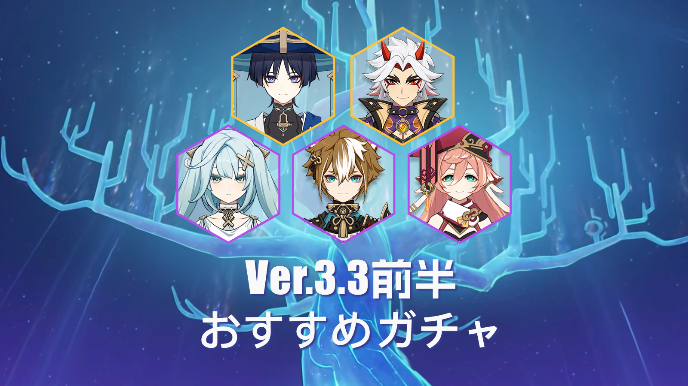

 

#### **１、「花坂豪快」荒瀧一斗**

　星5岩元素両手剣キャラクター・荒瀧一斗は元素反応を起さないにもかかわらず高火力を持つアタッカーです。無凸の荒瀧一斗は強力無比で、専用武器と合わせて使うならキャラランキングT1にも入れます。アタッカーを欠けているプレイヤーにおすすめです。

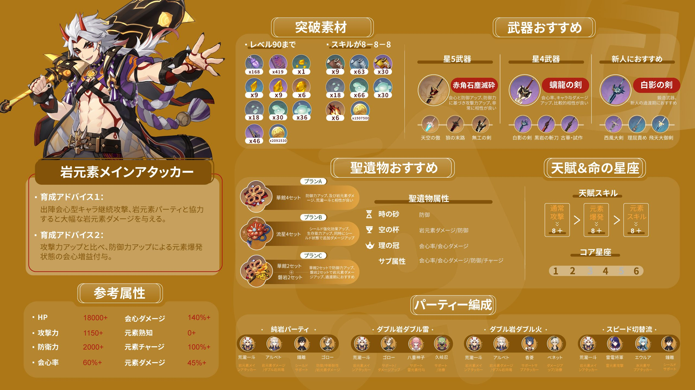

     

--【図一枚で分かる】♯キャラ攻略♯荒瀧一斗（性能解説/ビルド選択/パーティ編成）

 

--育成素材入手ルート攻略

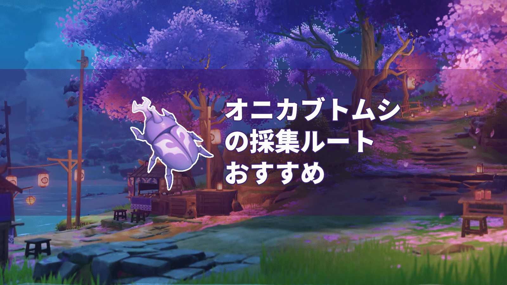

[オニカブトムシの採集ルートおすすめ](https://www.hoyolab.com/article/13783075)

  

--荒瀧一斗キャラデザイン

[荒瀧一斗キャラ設定考察](https://www.hoyolab.com/article/14091045)

#### **2、「久世浮傾」放浪者（散兵）**

放浪者はすなわち散兵。Ver.3.2の魔神任務で、散兵は雷神の神の心を利用して自分を神、つまりその巨大な機械人形に改造しようとした。散兵はその機械人形を駆使する者です。草神の力で浄化されて目覚めた後、散兵は旅人の仲間になったファトウスの二人目になります。放浪者は新たな生を歩みだした散兵ですね。

極まれなメイン火力になる星5風元素キャラ。強力な火力と浮遊状態などの特徴を持っています。【空居力】という独自のスタミナゲージがあるので、世界探索においても戦闘時においても放浪者は圧倒的な力を持っています。超おすすめです。

--【図一枚で分かる】♯キャラ攻略♯放浪者（性能解説/ビルド選択/パーティ編成）

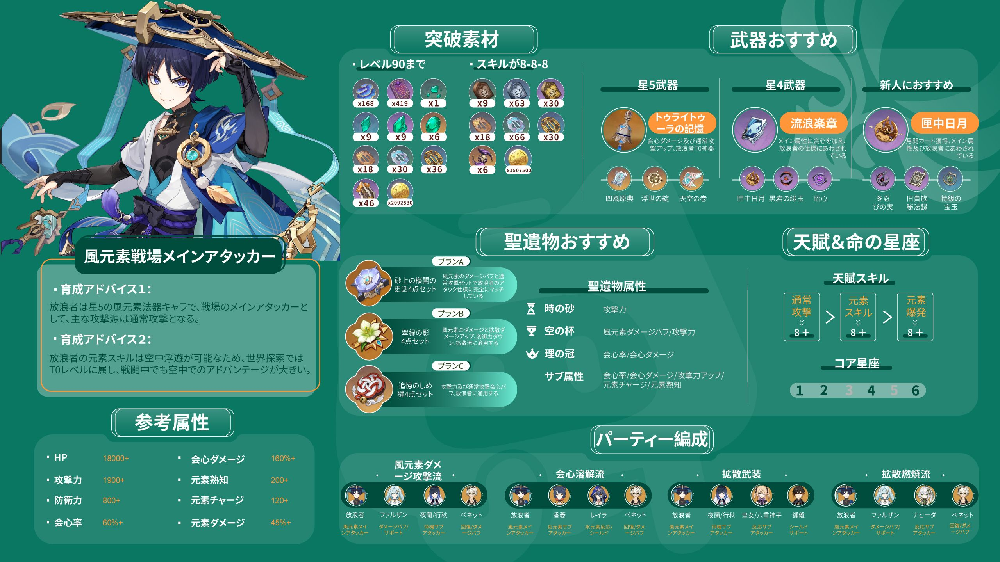

--ガチャ&育成攻略

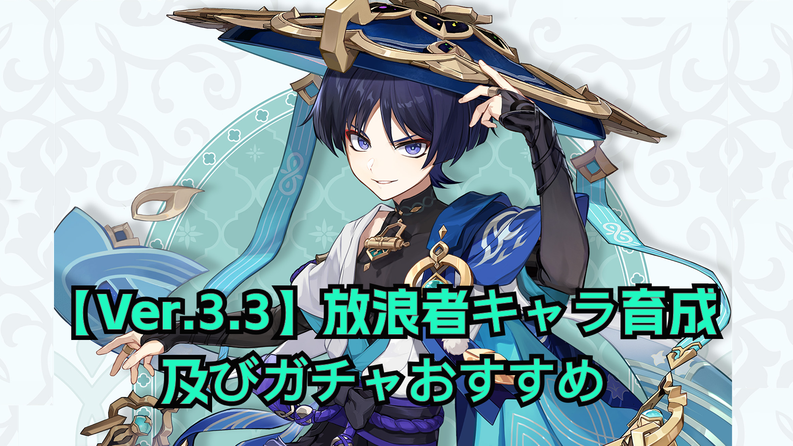

 

[**【Ver.3.3】放浪者キャラ育成及びガチャおすすめ**](https://www.hoyolab.com/article/14216127)

--育成素材入手ルート攻略

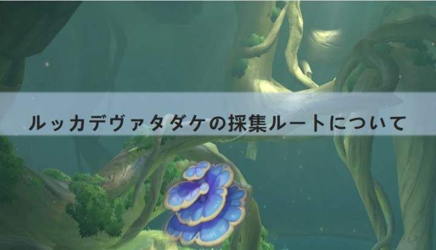

 [V.er.3.0ルッカデヴァタダケの採集ルートについて](https://www.hoyolab.com/article/7955164)

--魔物素材入手ルート攻略

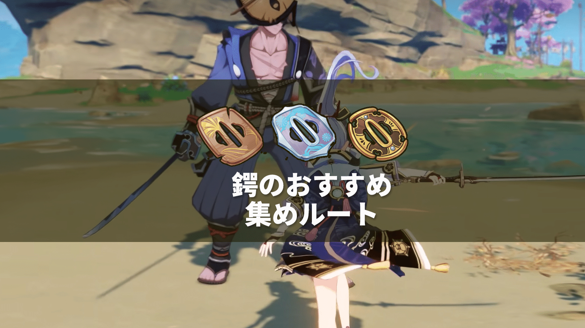

 [鍔のおすすめ集めルート](https://www.hoyolab.com/article/13809367)

--放浪者キャラデザイン

#### **3．「無邪気な知恵」煙緋**

星4炎元素法器キャラクター煙緋。育成しやすく、挙動が素直で扱いやすいので、初心者におすすめです。しかし、競合キャラはすでに数多く存在していて、それに炎元素アタッカーを育成したプレイヤーもたくさんいるので、育成上限が低い「煙緋」は大きく劣り、あまり期待できません。今回の複刻ガチャで煙緋が必要とする方々はぜひ引いてみましょう。

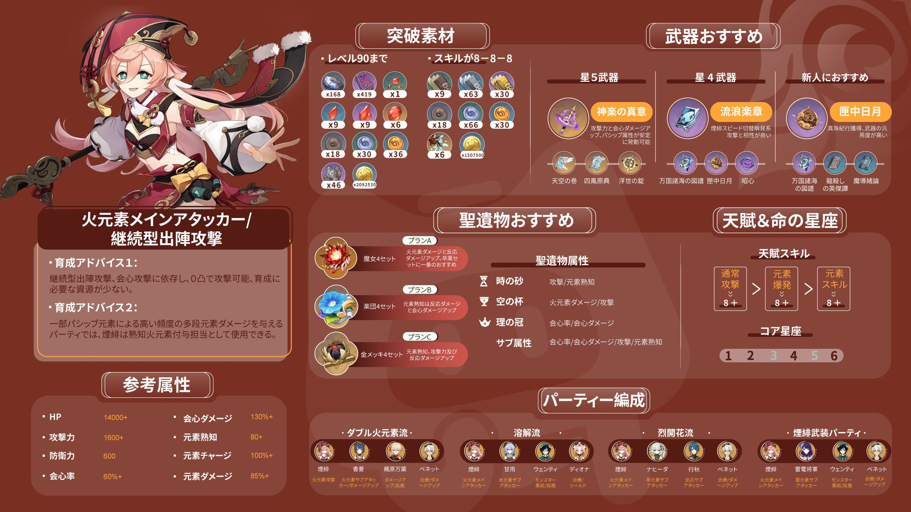

--【図一枚で分かる】♯キャラ攻略♯煙緋（性能解説/ビルド選択/パーティ編成）

--ガチャ&育成攻略

[キャラの性能分析とガシャのアドヴァイス——【煙緋】](https://www.hoyolab.com/article/14155947) 

--キャラの超詳細分析

 [ネットで一番わかりやすい煙緋のハードコア攻略](https://www.hoyolab.com/article/14156515)

--育成素材入手ルート攻略

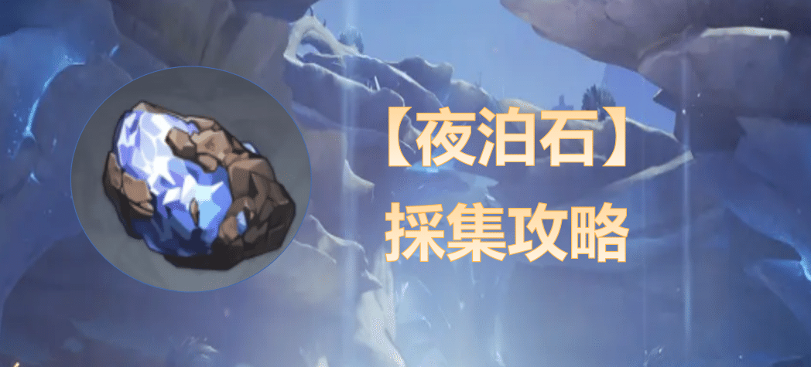

 

[パイモンでも分かる【夜泊石】の採集攻略](https://www.hoyolab.com/article/12312126)

--魔物素材入手ルート攻略

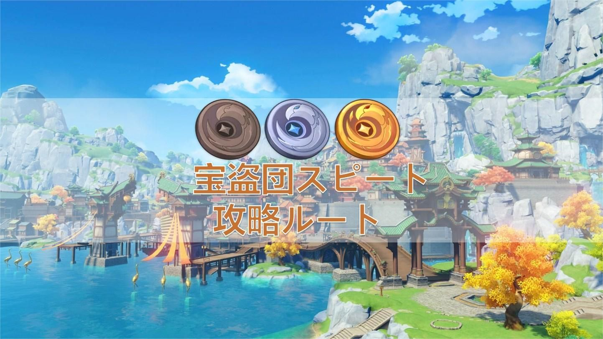

 [宝盗団スピート攻略ルート](https://www.hoyolab.com/article/12304317)

#### **4、「雄々しき戎犬」ゴロー**

可愛いゴローは岩元素弓キャラクターで、火力を伸びるサポーターです。岩元素チームに強力な火力アップ効果を付与でき、育成しやすいです。荒瀧一斗と合わせて使うと、強力なチームになります。

ゴローの耳を触って幸運をもらえるという噂もありますよ！

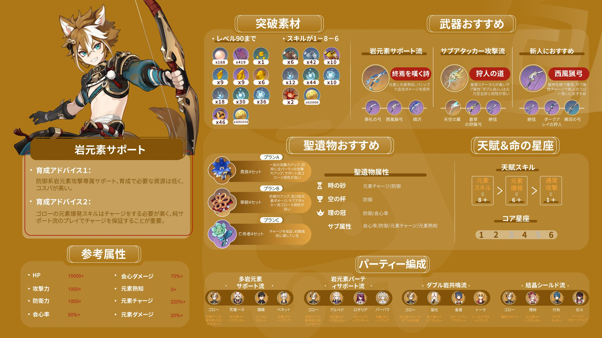

--【図一枚で分かる】♯キャラ攻略♯ゴロー（性能解説/ビルド選択/パーティ編成）

--ガチャ&育成攻略

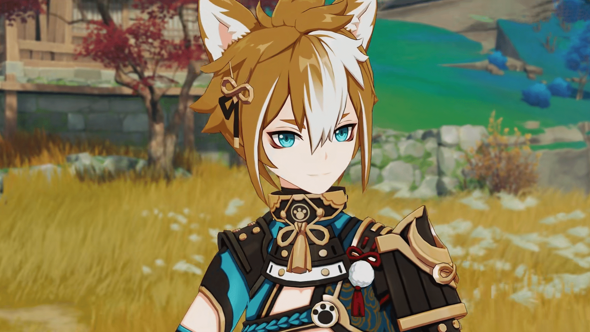

 

[キャラクター分析とガチャアドバイス――【ゴロー】](https://www.hoyolab.com/article/14156063)

--キャラの超詳細分析

 

[【キャラ攻略】ゴロー最強育成攻略](https://www.hoyolab.com/article/14156290)

--育成素材入手ルート攻略

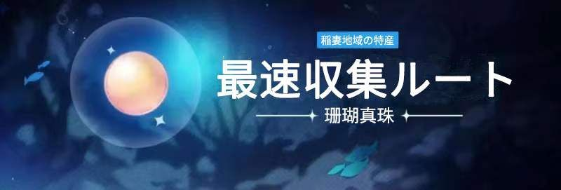

 

[パイモンでも分かる珊瑚真珠の入手方法](https://www.hoyolab.com/article/8471110)

--魔物素材入手ルート攻略

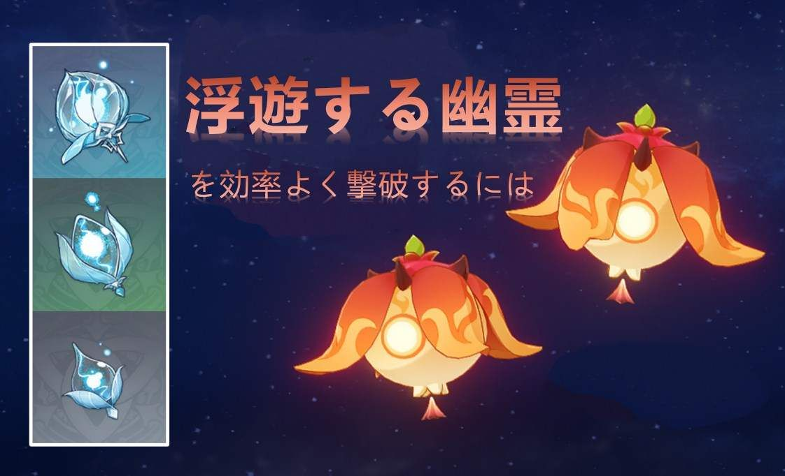

[浮遊する幽霊を効率よく撃破するには](https://www.hoyolab.com/article/8483830)

####  **5、「機求封秘」ファルザン**

新しい実装される星4キャラ・ファルザンは風元素弓キャラクターです。スメール人のファルザンは風元素専属のサポーターで、化け物を引き寄せます。

このキャラを気になる旅人にも攻略を用意しました。

     

--【図一枚で分かる】♯キャラ攻略♯ファルザン（性能解説/ビルド選択/パーティ編成）

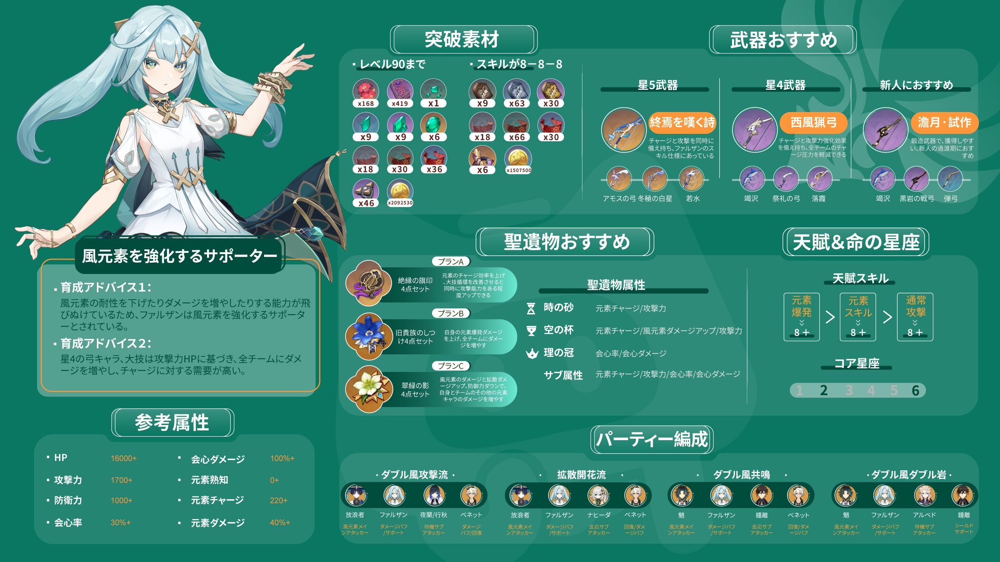

--ガチャ&育成攻略

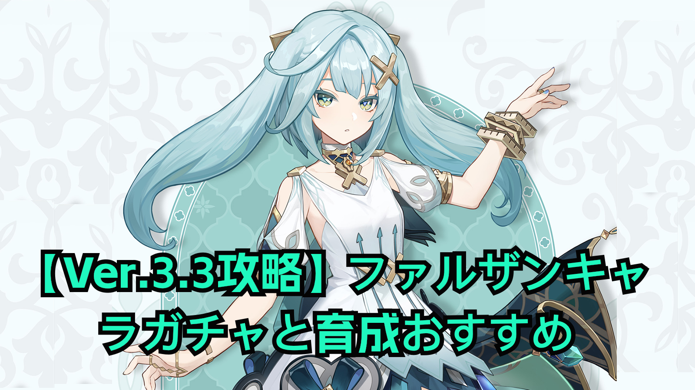

[**【Ver.3.3攻略】ファルザンキャラガチャと育成おすすめ**](https://www.hoyolab.com/article/14214242)

--キャラの超詳細分析

 

--育成素材入手ルート攻略

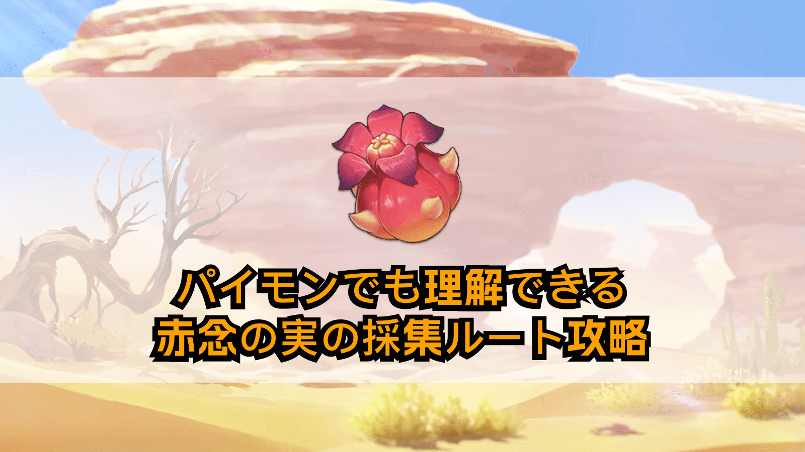

[パイモンでも理解できる赤念の実の採集ルート攻略](https://www.hoyolab.com/article/9989311)

--魔物素材入手ルート攻略

[パイモンでも分かれる【エルマイト旅団】線路](https://www.hoyolab.com/article/9423533)

Version: [zh-tw](https://www.hoyolab.com/article/14183709)/[ja-jp](https://www.hoyolab.com/article/14184074)/[en-us](https://www.hoyolab.com/article/14184039)/[es-es](https://www.hoyolab.com/article/14183919)/[ru-ru](https://www.hoyolab.com/article/14184353)[it-it](https://www.hoyolab.com/article/14184589)/[tr-tr](https://www.hoyolab.com/article/14184841)

