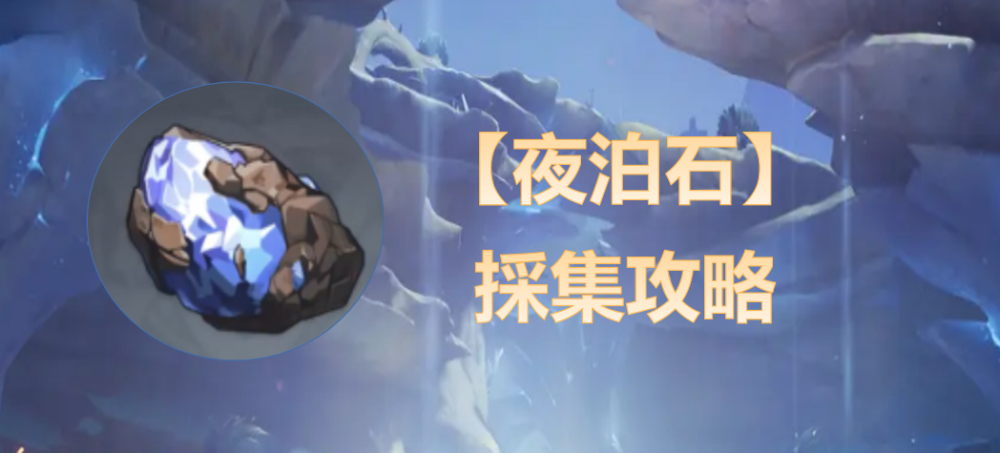
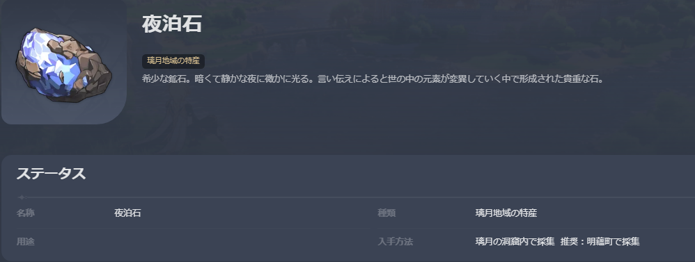
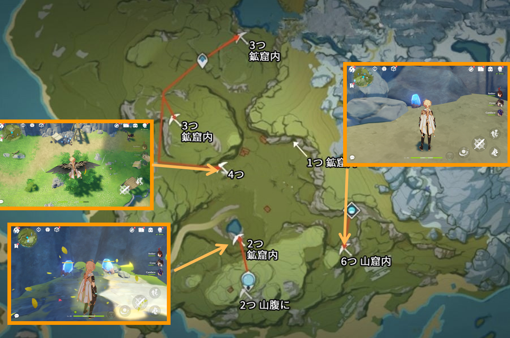
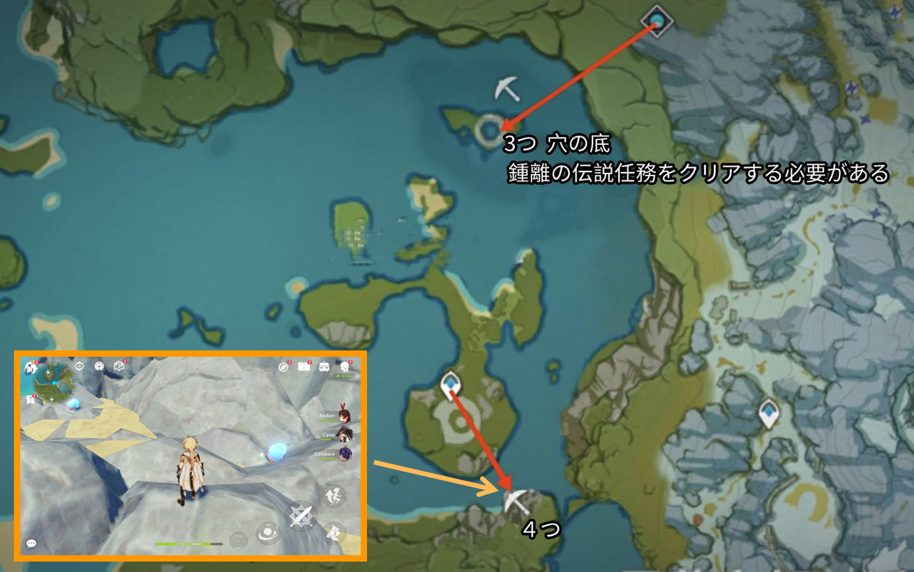
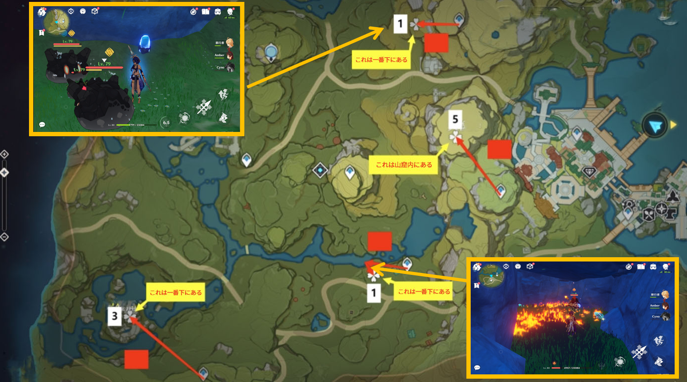
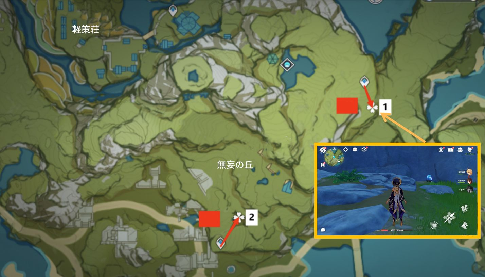
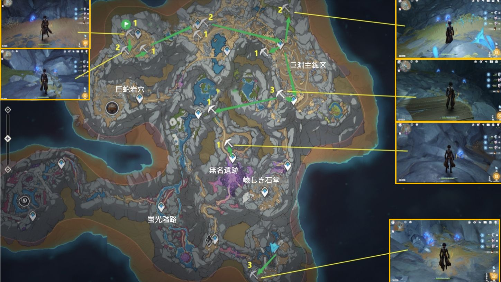
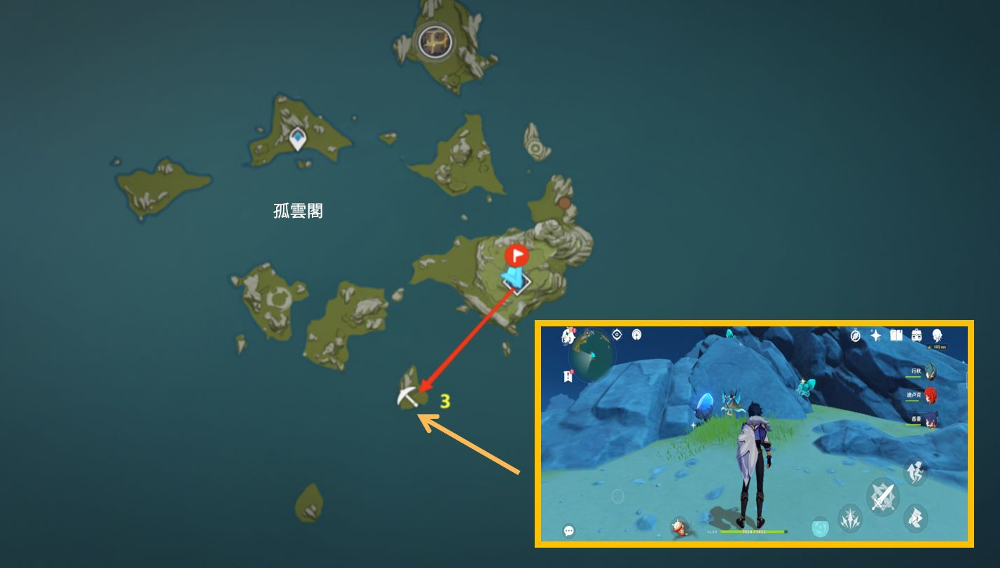
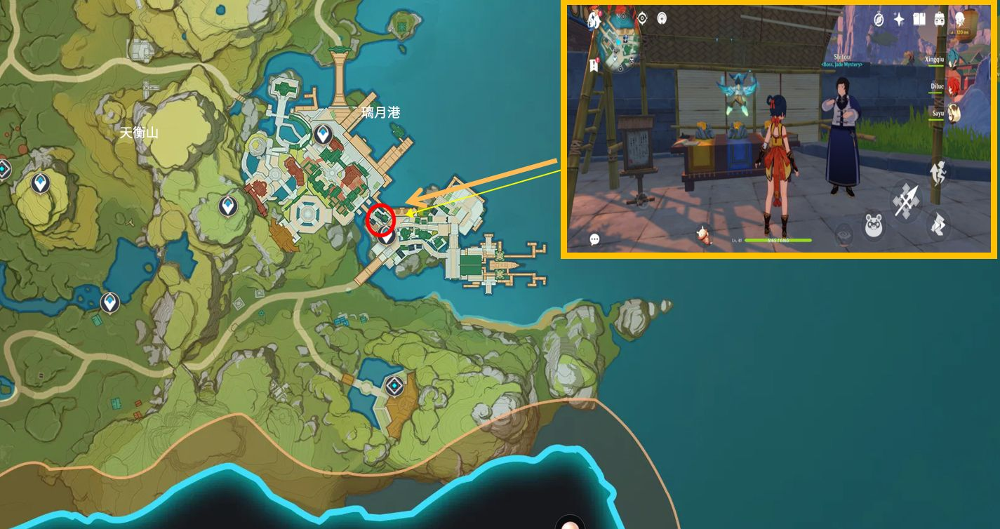

煙緋や北斗の突破素材としての夜泊石、みんなさんは最近足りないと思いませんか？夜泊石は非常に広く分布していますから、さぞ効率的な採集方法を知りたいのだろう？それでは、この夜泊石の採集攻略の記事を一緒に見てみましょう。

#### 

#### **【夜泊石に簡単な分析】**

**分布場所**：夜泊石は**璃月地方**の特産品で、分布が非常に広い。 すべてを採集するには時間がかかり過ぎるので、隅っこにあるやつを諦めて、**明蘊町**などの夜泊石の密集地帯で採集に専念することをお勧めします。そして、フィールドで採集する以外に、**解翠行の店主**から購入することも可能です。

**リフレッシュ時間**：夜泊石は**48時間**ごとに1回リフレッシュされるため、2日に1回しか採集できません。

 

**役割**：【夜泊石】の主な役割は、**煙緋**や**北斗**の突破素材として使われます。1キャラでレベル90まで突破するには**168**個が必要で、突破せずにレベル80までしか行かない場合も**108**個が必要となります。

**採集のアドバイス**：フィールド上の移動では、やはりスタミナ消費を抑えつつ移動速度を向上させる**双風の共鳴**がおすすめ、長距離の採集に最適とも言える。さらに、**鍾離**もしくはレザーなどの両手剣キャラをチームに加えるのもおすすめで*。**、**七七**や**煙緋**を持っている場合は、一緒にチームに加えるとよろし。彼女らは特産品をマークすることができて、採集の効率を上げられます。

#### **【採集ルート】**

**ルート1：明蘊町（****21個****）**

明蘊町は全フィールドの中で最も夜泊石が密集している場所で、大まかに3つの採集ルートに別れています。 明蘊町の夜泊石は**ほとんどが鉱山や洞窟にあり、左下の山腹にも2つあるので**、見逃さないように注意しましょう。

**ルート2：地中の塩（****7個****）**

明蘊町の上にある地中の塩の地域には合計7個の夜泊石があります、地図に示されたワープポイントにワープして、目的地で採集すればいい。注意すべきなのは、上にある3個の夜泊石はすべて*の底にあるので、鍾離の伝説任務をクリアした後にしか入手できません。 

**ルート3：天衡山（****7個****）＋青墟浦（****3個****）**

天衡山の付*には7個があり、そのうちの**洞窟内にある5個**は見逃せかねません。 他の2個は辺鄙な*や*窟の中にあるから、採集にはあまり効率的とは言えません、採集するかどうかは自分で判断しましょう。青墟浦の3個はいずれも山の麓にありますが、*くに偽物の岩があったり、モンスターも活躍したりするので、自分のニーズに合わせて採集するかどうかを選べばいいのです。

**ルート4：無妄の丘（****3個****）**

無妄の丘には3個の夜泊石しかありませんが、いずれもワープポイントから*く、採集しやすいので、採集をお勧めします。

**ルート5：層岩巨淵·地下鉱区(18)**

層岩巨淵·地下鉱区にはかなりたくさんのの夜泊石がありますが、採集するには簡単とは言えません。地図で示されているルート通りに進めば比較的効率的に採集できます。

**他の点在する隅っこ**

上記のルート以外にも、**孤雲閣**などの夜泊石を採集できるスポットがありますが、これらのスポットは全てバラバラ過ぎており、採集できる数も少なく、採集するには結構非効率的になります。だから、ここでは全てを紹介しません、採取するかしないかは自分で決めましょう。

#### **【他の入手方法】**

NPC【解翠行】の店長から購入。

**璃月の合成台**の横で、【解翠行】の店長NPCの石商さんから**5個の夜泊石**を購入できます。1000モラ1個、限定5個、3日ごとに更新。ちょっと高いですね。

#### **【まとめ】**

夜泊石はかなり広く分布しているため、フィールドのあちこちでも採集するのは効率が悪いので、通常はいくつかのスポットに集中して採集すれば十分なので、隅っこに散らばっているスポットは無視しても大丈夫です。さて、今回の内容は以上でした。旅人の皆さんが夜泊石を効率よく採集するための一助となれば幸いです。

Version: [zh-tw](../12311422/article)[ja-jp](../12312126/article)[en-us](../12313483/article)[es-es](../12314203/article)[ru-ru](../12314987/article)[it-it](../14175982/article)[tr-tr](../14176136/article)

