こんにちは、今回の攻略はオニカブトムシのおすすめ採集ルートをご紹介します。

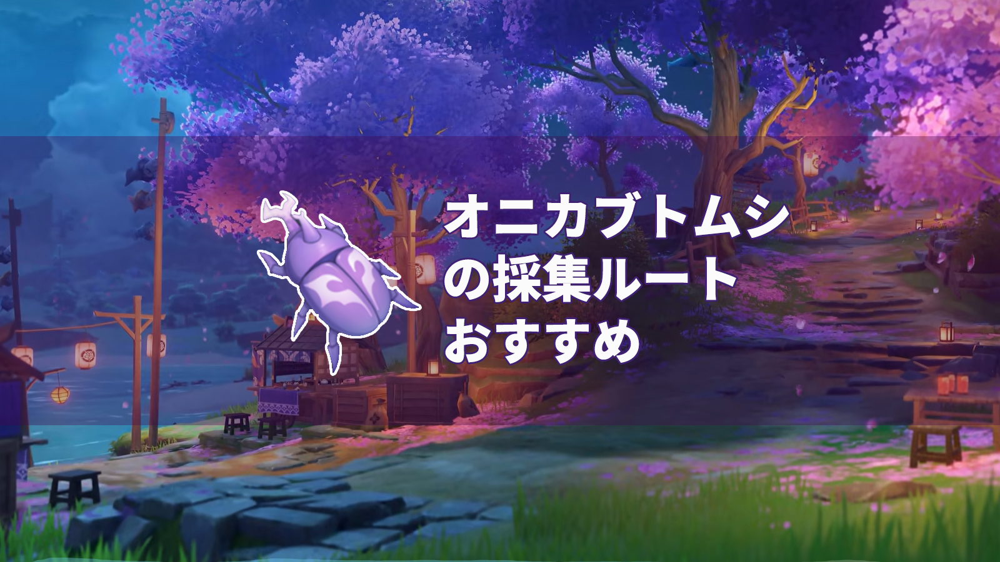

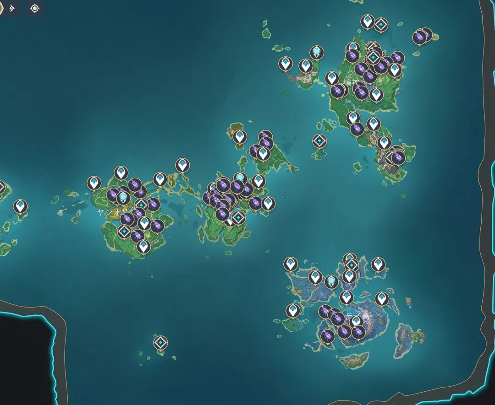

 

#### **携帯キャラクターのおすすめ**

**「ダッシュでスタミナ消費を減らせる」****という固有天賦を持つキャラは少なくとも一人をチームに編成し、****風元素のキャラ****2人と組み合わせるのがおすすめです。**

**おすすめ編成は次のとおりです。**

**楓原万葉+早柚+神里綾華+モナ**

**ダブル風元素****のキャラクタを使うと、バフがアクティブになり、素材の効率的な採集がやすくなります。**

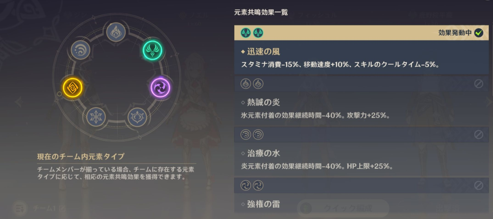

#### 

#### **おすすめルート**

#### **鳴神大社エリア**

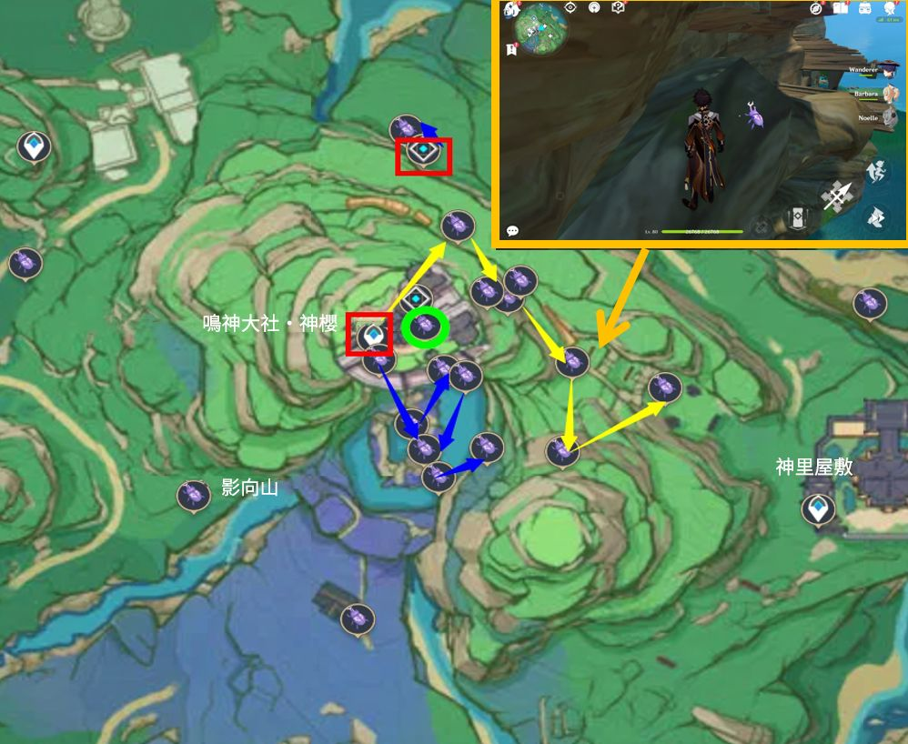

その中で黄*なルートは普通についていけばいい。青いルートは神社の下坑にあり、神桜大祓シリーズの任務を終えてから行くことができます、緑色の円でマークされたオニカブトムシは雷神の週間秘境のそばで、ワープで着けます。

 

#### **稲妻城エリア**

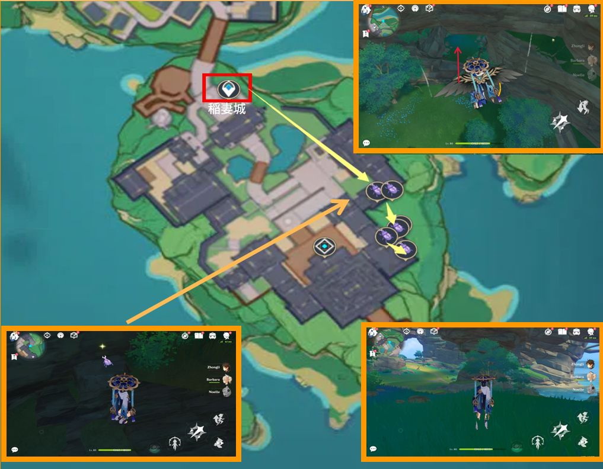

このエリアのオニカブトムシは稲妻城の下で、ワープポイントまでワープした後、飛んでワープポイントの東にある洞窟の入り口に入ります。

 

#### **たたら砂エリア**

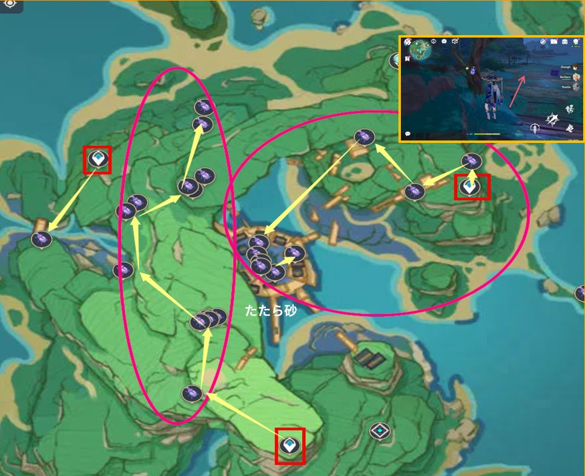

ルートマップに従えばいいです。

#### **蛇骨鉱坑と蛇神の首のエリア**

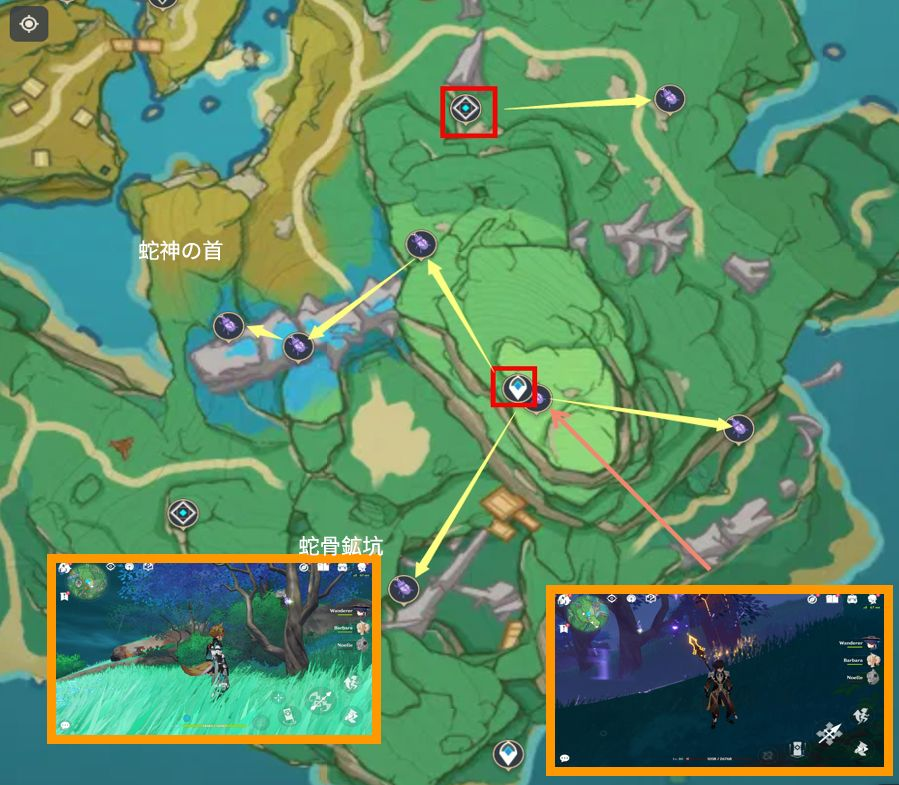

ここのオニカブトムシは分散していますので、ルート順はご自身でお選びください。

 

#### 無想刃狭間エリア

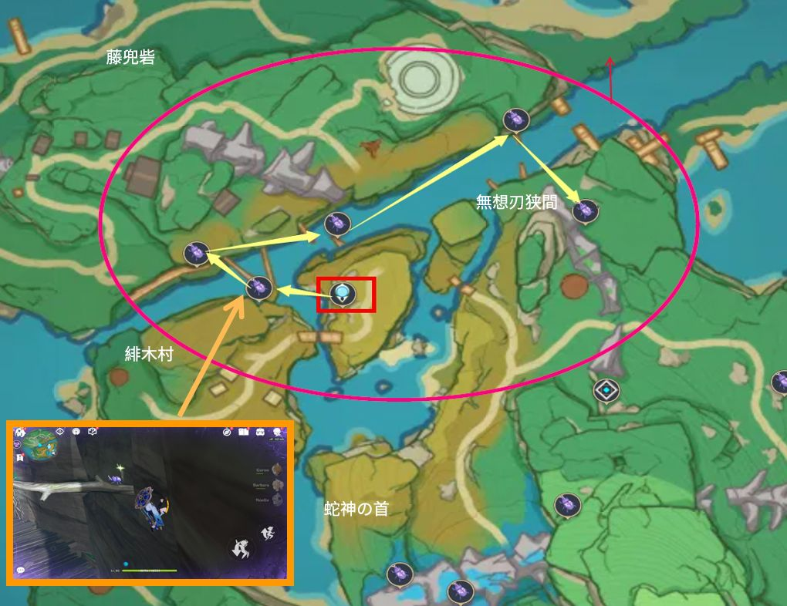

環境からのダメージを避けるために、雷の種を携帯するのを忘れないでください。

 

 

#### 神里屋敷エリア

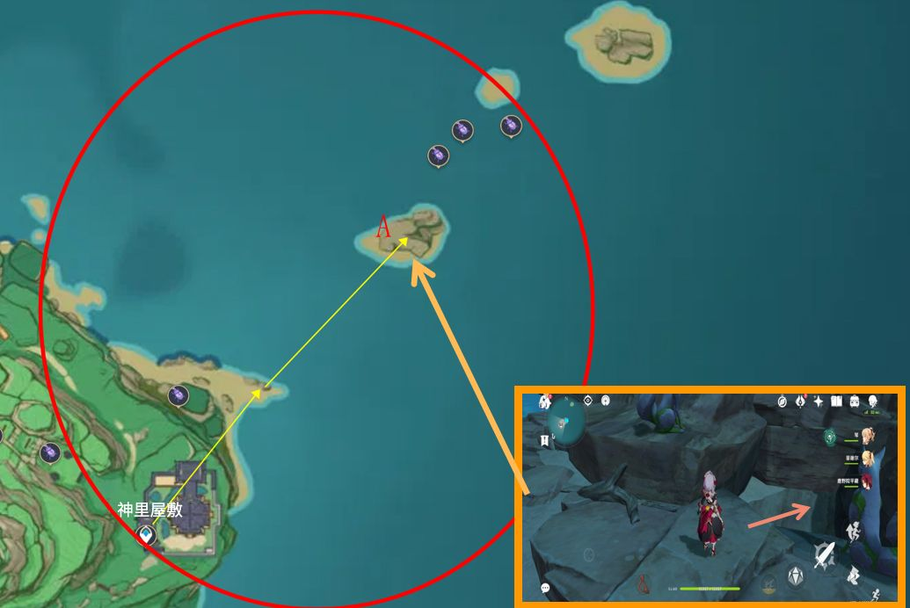

ルートマップに従えばいいです。ウェーブボートで島のAポイントへ行き、地下の密室を開けると、オニカブトムシが3匹見えます。

 

 

  

#### **九条陣屋エリア**

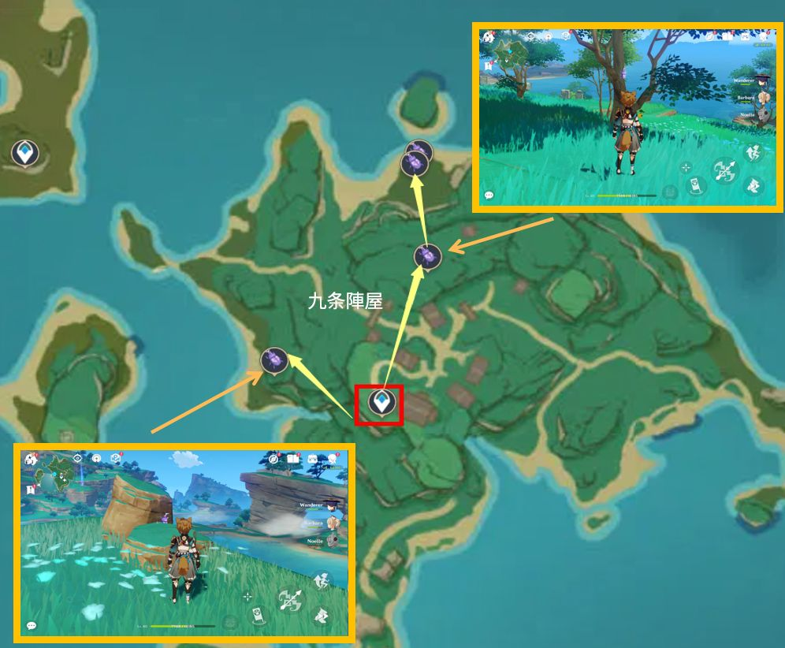

ルートマップに従えばいいです。

** **

#### **天雲峠エリア**

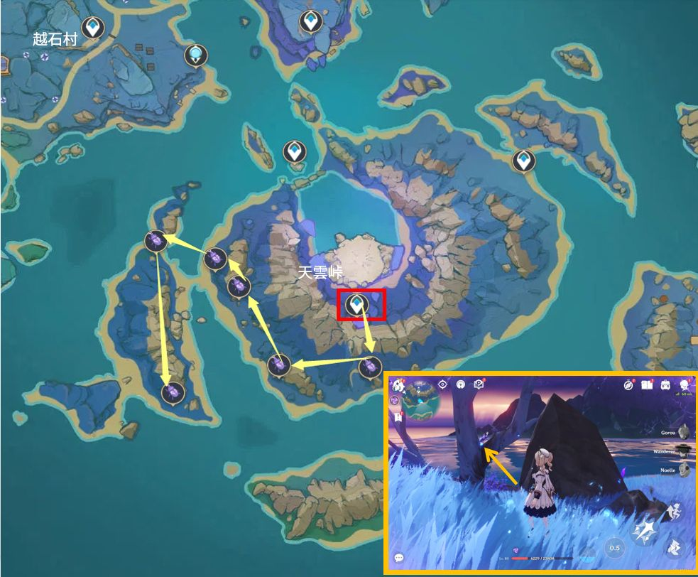

ここは距離が長いので、マップ探索に便利なキャラがおすすめです。

 

今回の攻略は以上です、素材採集でお役に立てればと思います、次回お会いしましょう。

 

Version: [zh-tw](../13783264/article)[ja-jp](../13783075/article)[en-us](../13783205/article)[es-es](../13783311/article)[ru-ru](../13783105/article)[it-it](../14177484/article)[tr-tr](../14177734/article)

