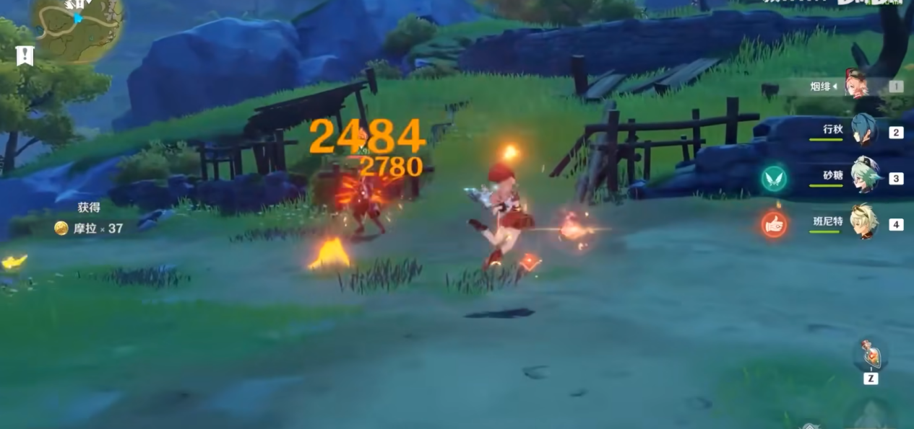
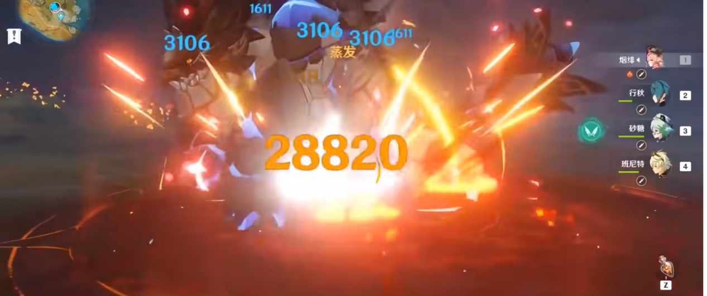
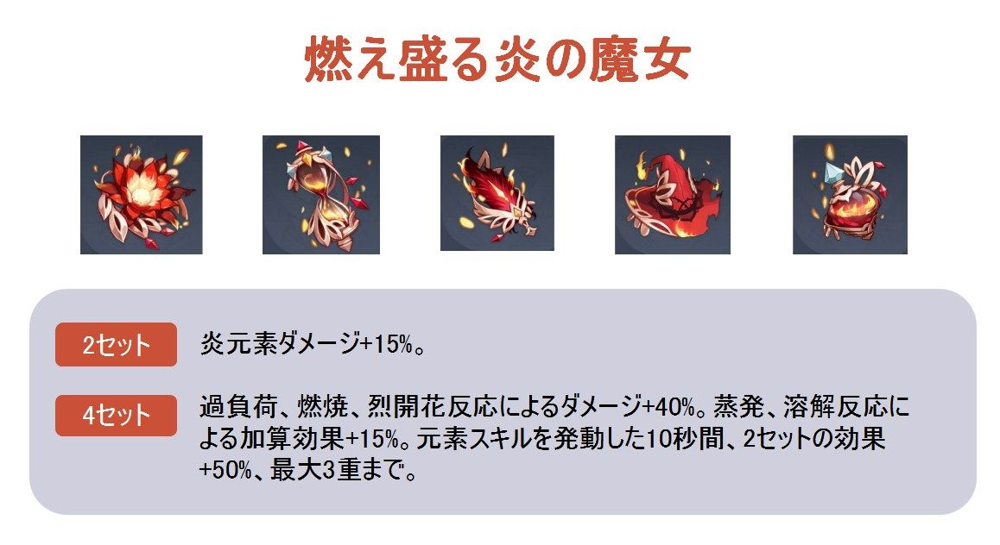
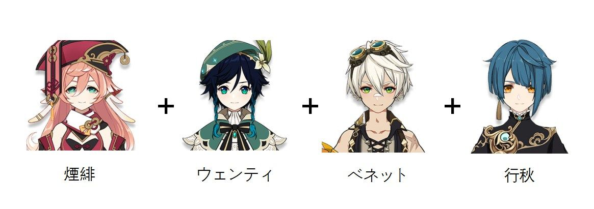
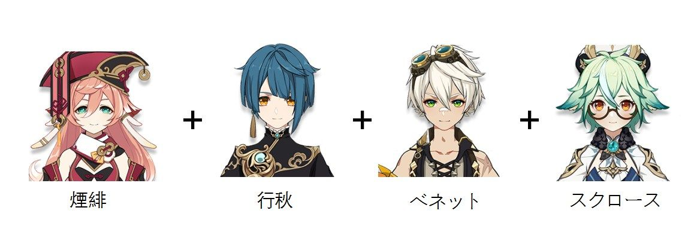

炎元素キャラの代表である煙緋は、一般的なパーティにも一定の地位を占めています。強力な爆発力は煙緋にメインアタッカーの性能を与え、炎元素アタッカーが必要なパーティによく適しています。では、煙緋はどれくらい強いのか、引く価値はあるのでしょうか？一緒に見ていきましょう。

 

#### **【キャラの位置付け】：メインアタッカー**

**煙緋は、炎元素法器メインアタッカーにして、典型的な長出場時間アタッカーキャラです**。煙緋の基礎攻撃力はレベル90で240に達し、星4キャラの中でもトップクラス、突破後はさらに炎元素ダメージを24％アップさせる。煙緋の通常攻撃と重撃は非常に操作しやすく、重撃はノックバック効果もあり、炎元素の優位性を生かした重撃は非常に高い元素反応ダメージを与えることができる。

煙緋は他のメインアタッカーと違って、命ノ星座にあまり頼らない、0凸でもそこそこのダメージを与える。また、煙緋は2、4、6凸になるとさらに強くなれる。0凸で出場、フル凸で戦神とよく言われる。一般のプレイヤーには2凸にするのが一番コスパのある、原石が十分にあれば、4凸や6凸にするのがベストです。

 

#### **【性能分析】**

煙緋の通常攻撃は敵を自動追跡ができる。広い攻撃範囲と快適な攻撃環境を持つだけでなく、通常攻撃と重撃は別々に元素付与のCDを計算している、どちらも弱炎付与である。通常攻撃や元素スキルの命中で得られた「丹火の印」により、独特な重撃システムを利用することで、スタミナ消費を大幅に減少し、重撃のダメージを強化することができます。**天賦のレベルアップにしては、まずは通常攻撃を優先する、次は元素爆発、最後は元素スキル。**重撃依存なので、優先に通常攻撃をフルレベルにすべき、次は重撃のダメージを上げるための元素爆発、最後はあまり重要ではない元素スキル。実戦では、煙緋は通常攻撃から始め、そして重撃から元素爆発を発動、再び重撃、次は元素スキルで「丹火の印」を再び付与してばた重撃を行う。この循環で高い蒸発ダメージを与える。

 

#### **【武器＆聖遺物】**

過渡期の武器については、イベントショップで交換できる【ドドコの物語】がおすすめです。この武器は、通常攻撃や重撃を行った後ダメージがアップできる、煙緋によく適していて入手もしやすい。**卒業武器は【四風原典】がおすすめ**、煙緋は出場時間が長いため、この武器のバフ効果を最高層に伸ばすことができ、ダメージが激増！聖遺物の第一候補は「燃え盛る炎の魔女」の4セットです。このセットは、煙緋に優れた炎元素ダメージボーナスと炎元素関連の元素反応ボーナスを提供することができて、煙緋の攻撃スタイルにもぴったり。

 

#### **【パーティ編成】**

煙緋の通常攻撃と重撃は、他の法器キャラとの大抵異なり、敵を自動的に追跡できる、その為パーティ編成にはかなり融通性がある。それでは、2つの主流編成をお勧めします、双炎蒸発パーティと煙緋、行秋、スクロース、ベネットパーティ。

おすすめパーティ1：煙緋メインアタッカー、ウェンティサブアタッカー、ベネットサポーター、行秋ダメージボーナス

煙緋とベネットの双炎共鳴をフル活用し、煙緋のダメージを大幅に上げることができるパーティです。行秋は煙緋に蒸発環境を提供し、合わせて元素反応ダメージを与える。ウェンティは敵を引き寄せて耐性を下げ、煙緋の重撃ダメージをさらに高める。そして、煙緋は元素爆発を放ち、重撃をすればいいのです。

 

おすすめパーティ2：煙緋メインアタッカー、行秋サブアタッカー、スクロースサポーター、ベネットサポーター

小型敵が多い環境に向いたパーティです。スクロースは安定な敵集めと耐性下げを提供、煙緋とベネットの双炎共鳴でダメージをアップ、行秋は裏で攻撃。実戦中、ベネットが元素爆発から始め、続いて行秋が高効率で水元素を付与して耐性を下げる、そしてスクロースが敵を引き寄せて耐性を下げる、最後に煙緋が元素爆発を放ち攻撃を始める。

 

#### **【ガシャのアドヴァイス】**

煙緋は星4キャラとして、他の炎元素アタッカーと装備が似ており、武器や聖遺物は他の炎元素アタッカーとそのまま使えるので、**入手や育成にかかるコストが低いです**。炎元素アタッカーが欠ける初心者の方や、炎元素法器キャラが欠ける方は、ガシャを引いてみるといい、煙緋は初心者にとってとても優しいですので。炎元素の星5キャラを持っている場合は、むりやり煙緋を引く必要はありません。

** **

#### **【まとめ】**

煙緋の仕組みがシンプルであり、操作も簡単ですぐに馴染める、しかも獲得しやすくで育成もしやすい。0凸でも大ダメージを出せるので、炎元素メインアタッカーまたは過渡期のメインアタッカーとして良い選択の１つであろう。炎元素アタッカーが欠ければ煙緋は間違いなくすべきなのだ。

 

Version: [zh-tw](../14155762/article)/[ja-jp](../14155947/article)/[en-us](../14155884/article)/[es-es](../14156385/article)/[ru-ru](../14153661/article)/[tr-tr](../14153997/article)/[it-it](../14154895/article)

