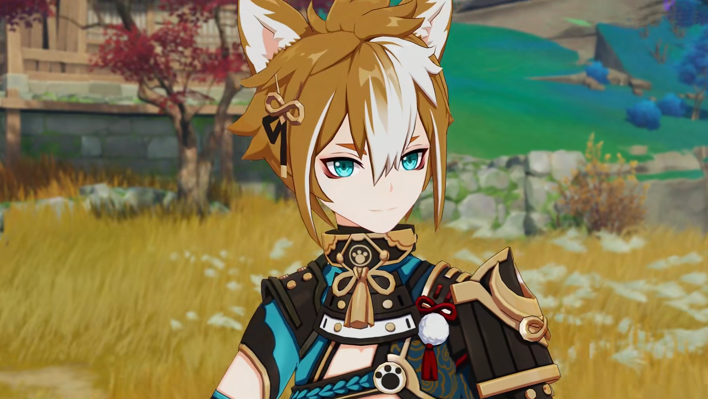
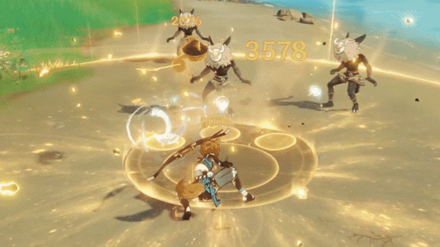
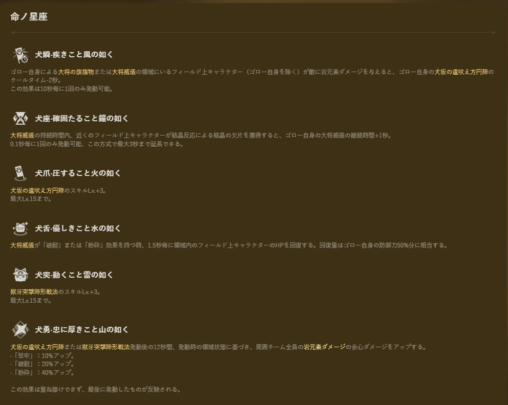
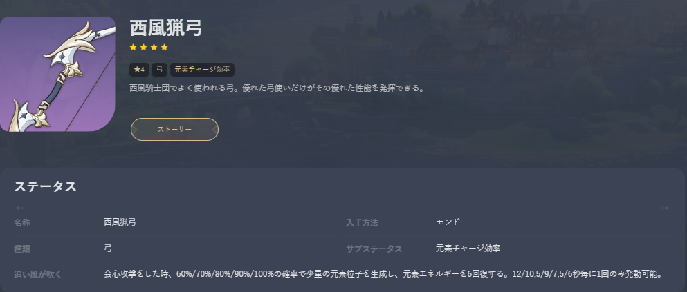
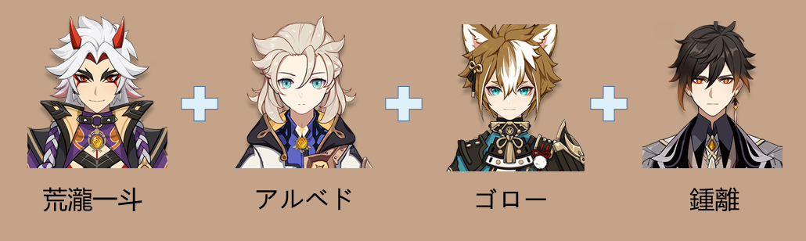
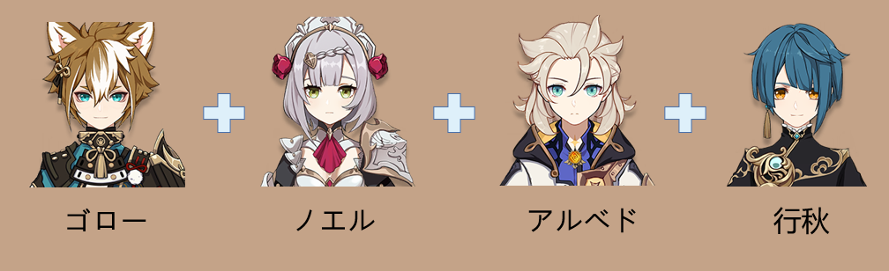

岩元素弓キャラクターのゴローはとても優秀なサポーターですね。では、ゴローの評価はどうでしょうか？どんな旅人に適しますか？今回の内容をぜひ参考にしてください。

 

#### **【キャラクター情報】：岩元素サポーター**

ゴローは**防御力をメインとする岩元素アタッカーに特化したサポーター**です。たとえば、ゴローは荒瀧一斗と相性がとてもいいです。ゴローの元素スキル・犬坂の遠吠え方円陣は地面に範囲の広い領域を生成し、岩元素範囲ダメージを与えます。それと同時に、大将の旗指物を掲げ、**チーム内の岩元素キャラクターの人数に応じて、領域内のキャラクターにバフを与えます**。岩元素キャラクター1人がいると、**防御力アップの効果**を獲得します。岩元素キャラクター2人がいると、上記効果に加え、**中断耐性がアップする**。岩元素キャラクター3人がいると、上記効果に加え、さらに**岩元素ダメージがアップする**。途切れのないバフであるため、ゴローはかなり強力なサポーターになります。しかし、最大効果を発揮するために、ほかの岩キャラと一緒に使わなければならないので、チーム編成は制約されています。

 

#### **【性能分析】**

防御サポ型の岩キャラの中で、ゴローは相当強い実力を持っていて、岩元素チームでかけがえのない存在と言えます。でも、完凸でないゴローは非防御系の岩元素キャラへのサポートが普通で、**元素スキルによる固定的な15％の岩元素ダメージアップ効果**しか獲得できません。そのため、バフ能力はゴローのステータスにあまり影響されません。ゴローの育成には**元素チャージの確保**に集中すればいいです。**無凸のゴローは完全な岩元素サポート能力を持ち**、2凸では**シールドサポーター**として使えます。**4凸になるとヒーラーとして使う**ことができます。特に岩元素キャラをメインとするチームにいると、**完凸のゴロー**はダメージアップ効果を大きく伸ばせます。

 

#### **【武器と聖遺物】**

おすすめの武器：**西風猟弓＞祭礼の弓＞終焉を嘆く詩**、ゴローの武器は獲得やすいです。西風猟弓は安定な元素チャージ効率を提供できるため、ゴローにおすすめです。聖遺物なら**初期の育成**に**亡命者4セット**がおすすめです。その他、**旧貴族のしつけ4セット**がダメージアップという追加効果を持っていて、ゴローとの相性が抜群です。

 

#### **【おすすめパーティ編成】**

ゴローの核心スキルである元素スキルは、パーティの編成に大きな制限をもたらしてしまいます。もしゴローをサポーターにしたら、最大のサポート効果を発揮するために最低限3名の岩元素キャラの編成が必要です。そういう特徴があるので、チーム編成は制限されています。

**おすすめパーティ1：メイン火力・荒瀧一斗、サブ・アルベド、サポート・ゴロー、火力補助・鍾離**

主流パーティの一つ。荒瀧一斗はメイン火力で、ゴローはサポーターで、防御力バフを提供します。完凸のゴローなら会心ダメージアップ効果をも提供できます。アルベドはサブアタッカーとして、鍾離、ゴローと合わせて元素チャージ効率をアップさせます。そうすると、鍾離の全元素耐性を低下させる効果とゴローのサポートの恩恵を同時に受けることができます。全員の能力を最大限に発揮できるので、強力無敵なチームになります。

 

**おすすめパーティ2：ゴロー＋ノエル＋アルベド＋行秋**

まず、ゴローは元素スキルと元素爆発を発動します。続いてアルベドは元素スキルを発動すします。そして、行秋は元素爆発を発動したあと二回元素スキルを使って、ノエルに切り替えます。ノエルは元素爆発を発動し、通常攻撃を三回*り返したあと、元素スキルを発動し持続的に通常攻撃をします。この時、ゴローに切り替え元素スキルを補充し、またノエルを使って持続的に攻撃を与えます。この流れに従ってかなり強力なダメージを与えますよ。

 

#### **【ガチャアドバイス】**

ゴローは岩元素をメインとするチームに欠かせないサポーターで、全岩キャラチームにとって火力を大きく伸ばせるバフを持っています。岩元素メイン火力・荒瀧一斗とノエルとの相性がとてもいいです。一斗、もしくはノエルをメイン火力とするのなら、ゴローはおすすめです。メイン火力はほかのキャラである場合、ゴローを使ってマップで稲妻特産物に標記をつけてもいいです。

#### **【まとめ】**

ゴローは全岩キャラチームに欠かせないサポーターです。荒瀧一斗とノエルと一緒に戦う場合、防御力を基準にダメージを与えると同時に、防御力・岩元素ダメージ・会心ダメージアップ効果を提供できます。全岩キャラパーティを使いたいなら、ゴローはおすすめです。そうでない場合、ゴローを使って効率よく図鑑の品物を増やしましょう。

Version: [zh-tw](../14153693/article)/[ja-jp](../14156063/article)/[en-us](../14156027/article)/[es-es](../14156224/article)/[ru-ru](../14156556/article)/[tr-tr](../14153860/article)/[it-it](../14154784/article)

