3.3版本上半的卡池來收原石啦。這次除了**荒瀧一鬥**和**流浪者（散兵）**兩位五星角色，**煙緋**、**五郎**兩位四星角色外，我們還迎來了一位四星新角色**琺露珊**，據小道消息說是新的風系大*，原神親女兒，與**流浪者（散兵）**並稱為此次的風系雙子星，具體是不是這樣的，各位旅行者們可以抽抽試試看哦！

在這裏我為大家精選了一批3.3版本的上半卡池的角色攻略匯總如下：

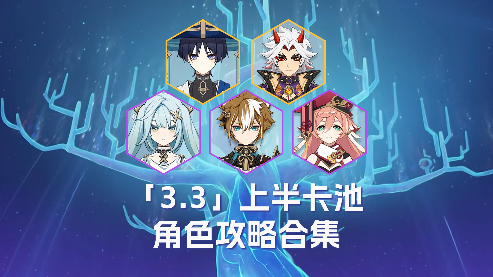

	

 

#### **1、「花阪豪快」荒瀧一鬥**

**荒瀧一鬥**五星岩系雙手劍角色，是一個幾乎不參與元素反應，卻擁有高傷害的駐場主C，0命的**荒瀧一鬥**也是實力不俗，加上他的個人專武純純是T1梯隊，缺少主C的玩家可以閉眼入。

	 

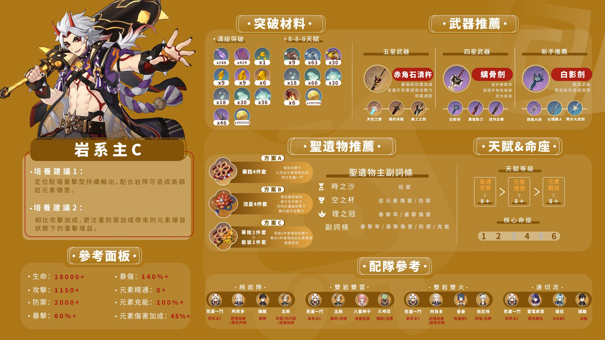

——【一圖流】#角色攻略# 荒瀧一鬥（機制解析/裝備選擇/隊伍搭配)

——養成材料收集路線攻略

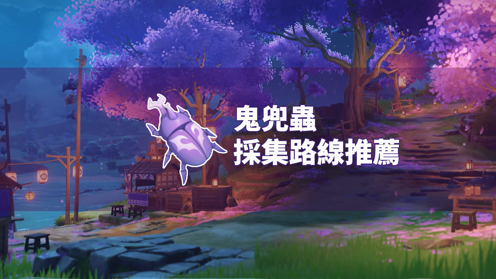

[**鬼兜蟲採集路線推薦**](../13783264/article)

 

 

——荒瀧一鬥人物設定考據

[**荒瀧一斗人物設定考據**](../14090803/article)

#### 2、**「久世浮傾」流浪者（散兵）**

**流浪者**就是散兵，3.2劇情中，利用雷神的神之心，將自己改造成了神，也就是一個巨大的機甲，本體是機甲的駕駛員。在被草神的力量淨化之後，散兵清醒過來，成為第二個加入旅行者的愚人眾執行官。總而言之，流浪者相當於是洗白後的散兵。

他本質上仍是一位少見的五星風系站場主C，擁有高倍率輸出、浮空等特點，【空居力】這個特點可是獨一無二的，不管是跑圖還是打怪**流浪者**現在屬於bug一樣的存在，不抽後悔小半年。

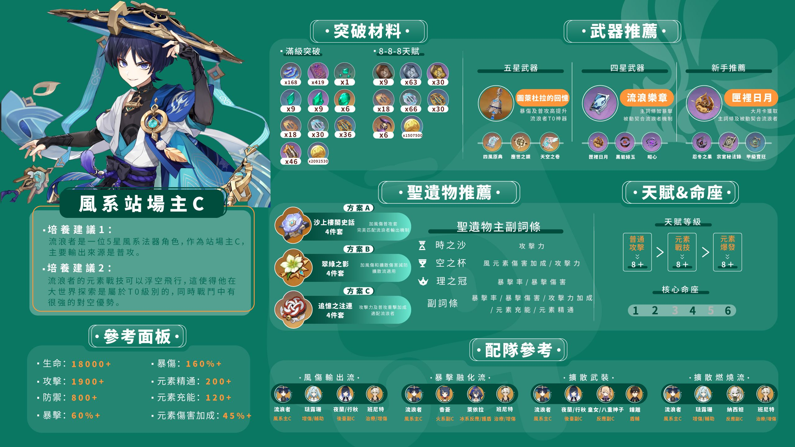

——【一圖流】#角色攻略# 流浪者（機制解析/裝備選擇/隊伍搭配)

——角色抽取&培養攻略

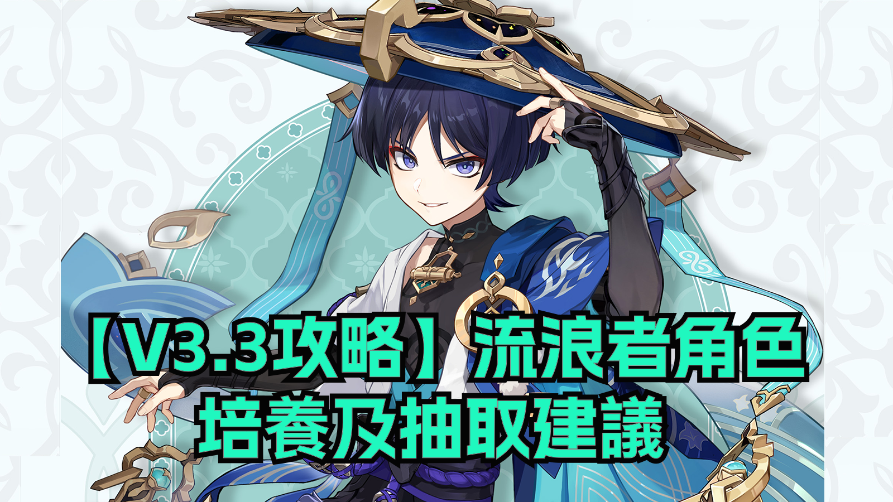

[**【V3.3攻略】流浪者角色培養及抽取建議**](../14215809/article)

 

——養成材料收集路線攻略

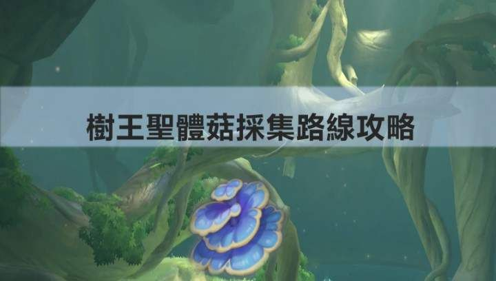

[3.0版本樹王聖體菇採集路線攻略](../7943227/article)

——養成材料怪物**路線攻略

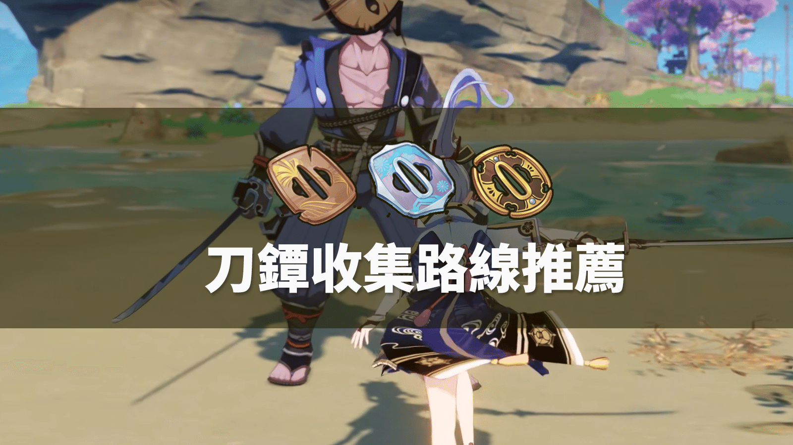

[**刀鐔獲取路線推薦**](../13811751/article)

——流浪者人物設定考據

#### **3.「智明無邪」煙緋**

**煙緋，**四星火元素法器角色，由於培養成本較低，機制簡單粗暴，操作手感優異，非常適合萌新使用。但對於角色池已經飽和，不缺少火C的高練度玩家，「**煙緋**」的定位十分尷尬，難有用武之地，是一位低上限高下限的角色。本次返場玩家可按需抽取。

 

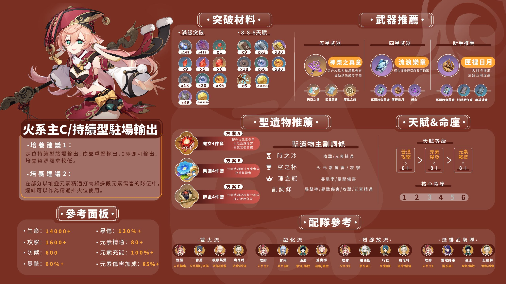

——【一圖流】#角色攻略# 煙緋（機制解析/裝備選擇/隊伍搭配)

 

——角色抽取&培養攻略

[**角色強度分析與抽取建議——【煙緋】**](../14155762/article)

 

——角色硬核解析攻略

[**角色強度分析與抽取建議——【煙緋】**](../14155762/article)

 

——養成材料收集路線攻略

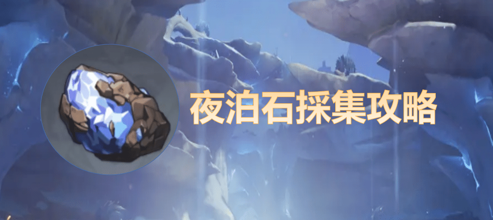

[**派蒙都能看懂的夜泊石採集攻略**](../12311422/article)

 

——養成材料怪物**路線攻略

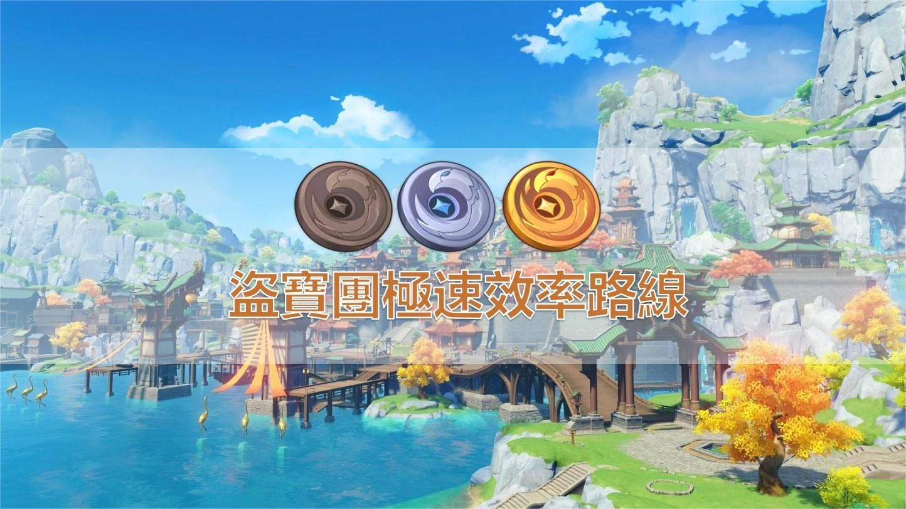

[**盜寶團極速效率路線**](../12303080/article)

#### **4、****「戎犬鏘鏘」 五郎**

可愛系**五郎**是一位增傷輔助型弓箭角色，作為岩隊輔助使用，高命座條件下有著極強的岩隊傷害增幅效果，綜合培養成本較低。與荒瀧一鬥搭配，能力得到了顯著提升。

據說摸摸**五郎**的耳朵會有好運哦！

	 

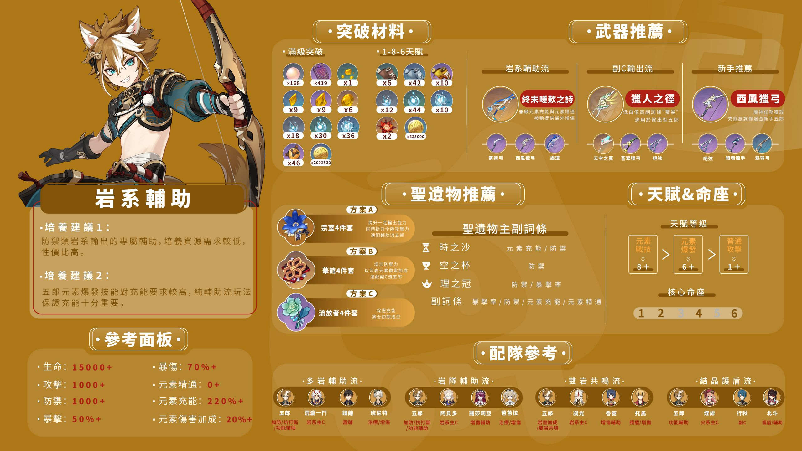

——【一圖流】#角色攻略# **五郎**（機制解析/裝備選擇/隊伍搭配)

——角色抽取&培養攻略

[**角色強度分析與抽取建議——【五郎】**](../14153693/article)

[**【角色攻略】五郎全方位培養攻略**](../14155301/article)

——養成材料收集路線攻略

[**派蒙都能看懂的珊瑚真珠採集攻略**](../8397727/article)

——養成材料怪物**路線攻略

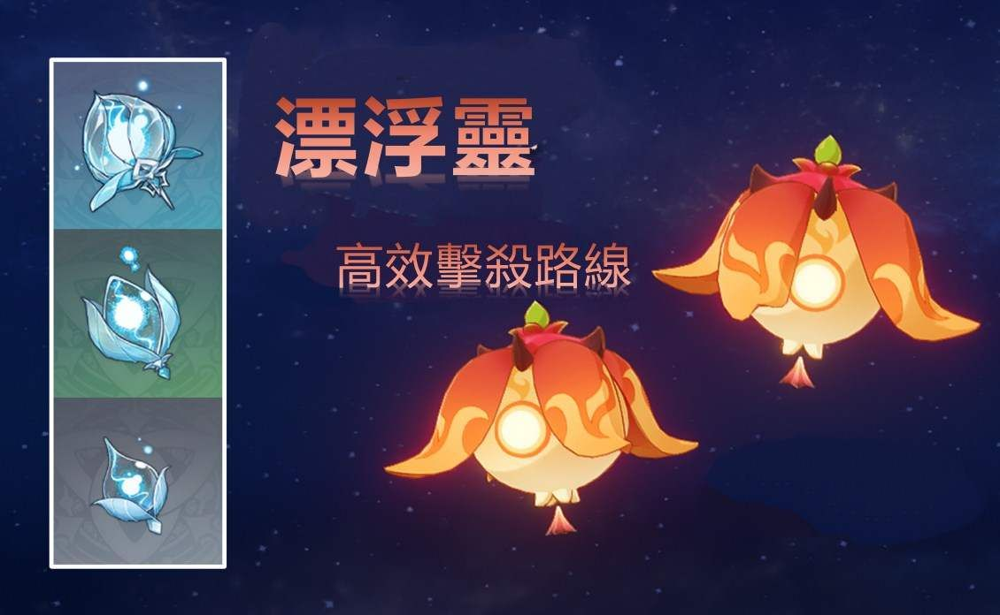

[**漂浮靈高效擊殺路線**](../8476753/article)

#### **5、****「機逐封秘」琺露珊**

全新四星角色**琺露珊****，**為四星風元素弓箭角色，定位為風拐和聚怪型輔助，來自須彌。 

我們也為心水這個新角色的小夥伴準備了一系列攻略：

——【一圖流】#角色攻略# 琺露珊（機制解析/裝備選擇/隊伍搭配)

——角色抽取&培養攻略

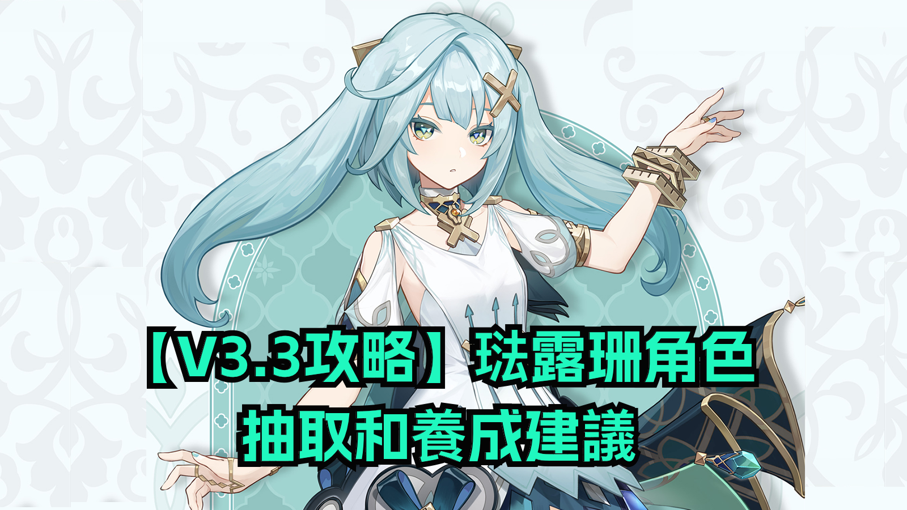

[**【V3.3攻略】琺露珊角色抽取和養成建議**](../14213954/article)

——角色硬核解析攻略

 

—— 養成材料收集路線攻略

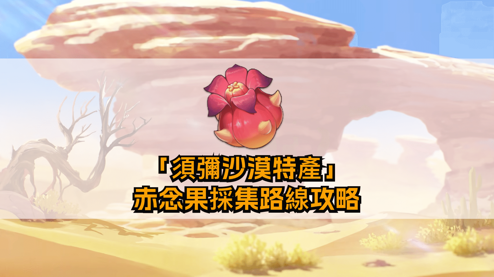

[**派蒙都能看懂的赤念果採集路線攻略**](../9974262/article)

——養成材料怪物**路線攻略

[**派蒙都能看懂的【鍍金旅團】路線**](../9422055/article)

 

Version: [zh-tw](../14183709/article)/[ja-jp](../14184074/article)/[en-us](../14184039/article)/[es-es](../14183919/article)/[ru-ru](../14184353/article)[it-it](../14184589/article)/[tr-tr](../14184841/article)

