¡El gachapón de la primera mitad de la versión 3.3 viene a llevarse tus protogemas! En esta ocasión, además de los dos personajes de 5*, **Arataki Itto** y **Trotamundos (Scaramuccia)**, y los dos personajes de 4*, **Yanfei** y **Gorou**, hay un nuevo personaje de 4*, Faruzán. Según las informaciones, es la nueva y poderosa apoyo de Anemo, y junto con Trotamundos (Scaramuccia), son los gemelos de Anemo esta vez. En cuanto a los detalles, ¡pueden comprobarlos ustedes mismos!

Aquí tengo una selección de guías de personajes e información para la primera mitad del gachapón para la versión 3.3, como sigue:

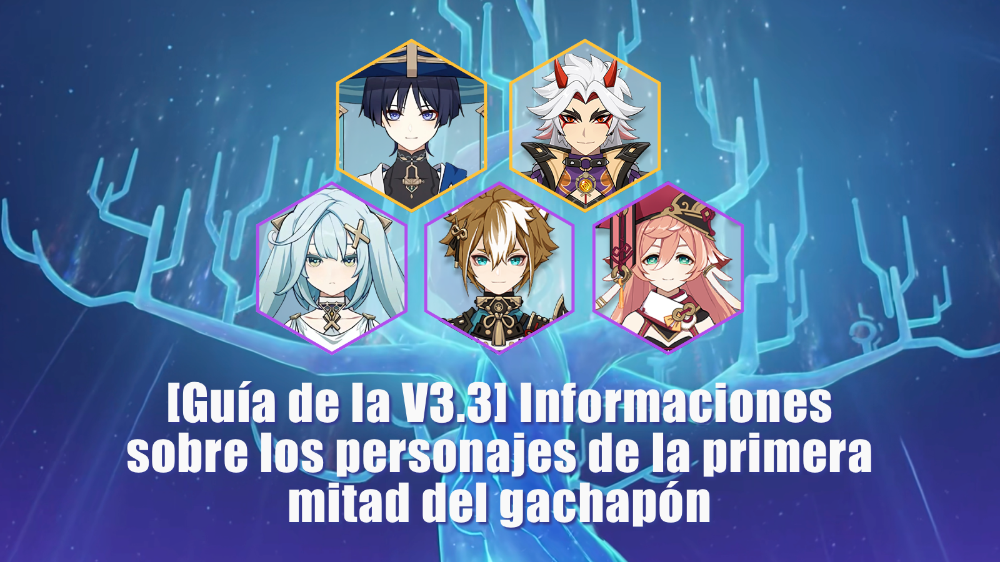

#### **1. El Héroe de Hanamizaka: Arataki Itto**

**Arataki Itto** es un personaje de 5*, Geo, Mandoble, un atacante que apenas provoca las reacciones elementales pero que tiene un alto daño de forma constante en el campo de batalla. C0 **Arataki Itto** también es poderoso, y con su arma exclusiva, está en la segunda clase de fuerza. Los jugadores que no tengan un atacante pueden elegirlo.

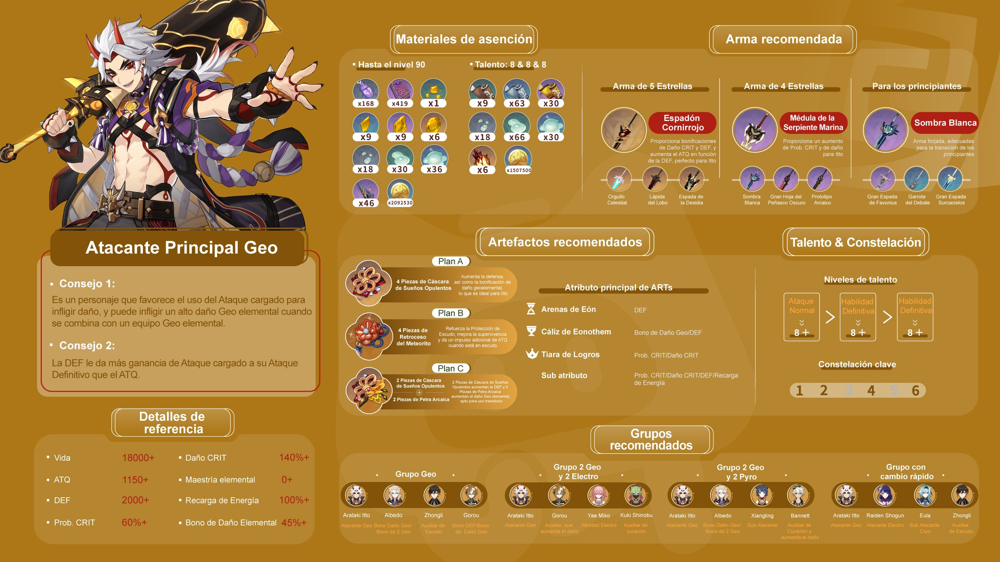

--Una #guía completa# sobre Arataki Itto: Sus habilidades, Armas, Artefactos y equipos recomendados

--Rutas para conseguir el objeto típico que necesita

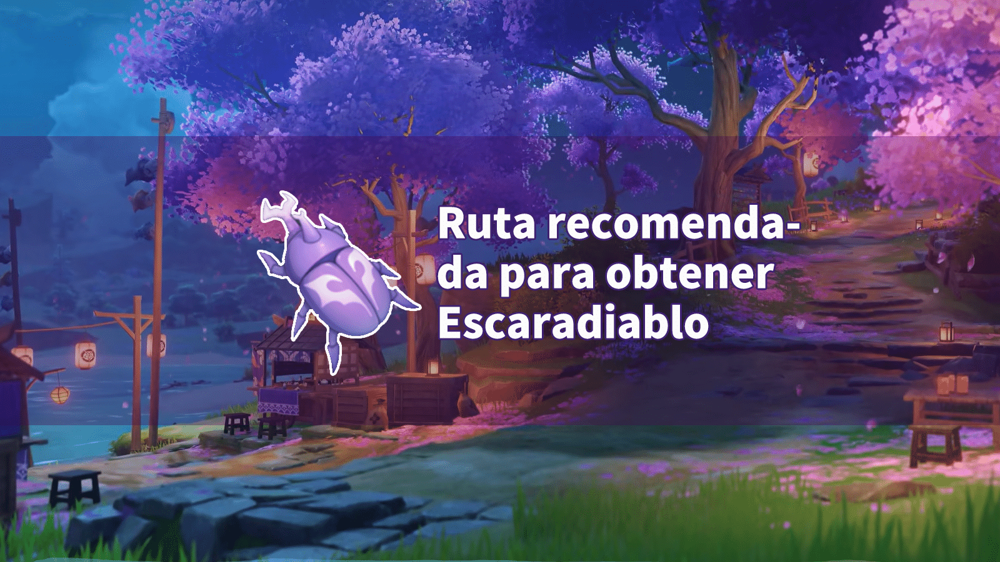

[Ruta recomendada para obtener Escaradiablo](../13783311/article)

 

--La información y la historia sobre Arataki Itto

[Estudio e Investigación del Personaje Arataki Itto](../14090217/article)

#### 2.** El Caminante Eterno: Trotamundos (Scaramuccia)**

**Trotamundos** es Scaramuccia, quien, en la versión 3.2 de la historia, utiliza la Gnosis de Arconte Electro para transformarse en Arconte, un mech gigante del que es piloto. Tras ser purificado por el poder de Arconte Dendro, Scaramuccia vuelve a la cordura y se convierte en el segundo ejecutivo de Fatui que se une al equipo del Viajero. En definitiva, Trotamundos equivale a Scaramuccia que ha dejado atrás su pasado y todo.

Sigue siendo un personaje de 5*, Anemo, atacante. Tiene un alto multiplicador de daño, flotación y otras características. Su “persistencia celeste” es única y, ya sea explorando el mundo o luchando contra monstruos, **Trotamundos** es ahora tan impresionante que si no lo adquieres, seguramente lo lamentarás durante al menos seis meses.

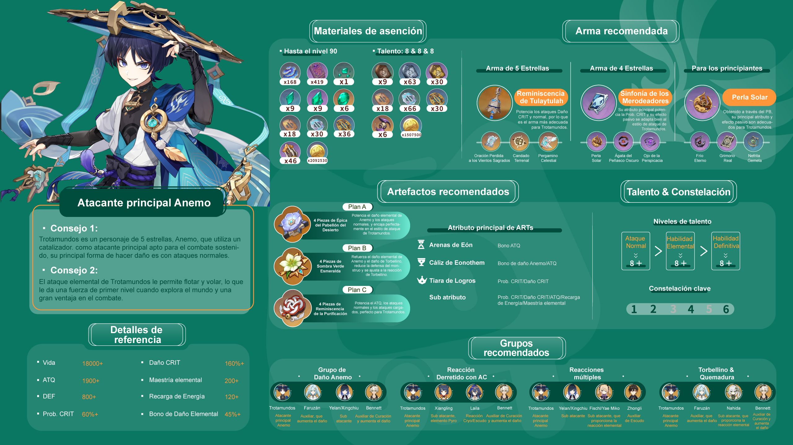

--Una #guía completa# sobre Trotamundos: Sus habilidades, Armas, Artefactos y equipos recomendados

-- Consejo de gacha & Guía de mejora

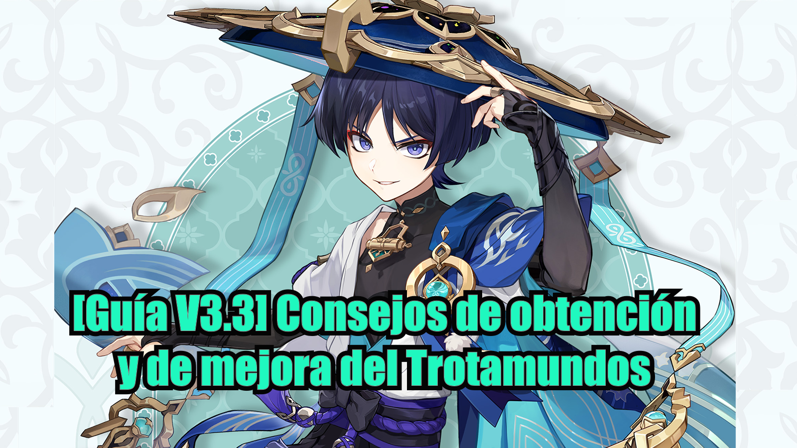

[**[Guía V3.3] Consejos de obtención y de mejora del Trotamundos**](../14216493/article)

--Rutas para conseguir el objeto típico que necesita

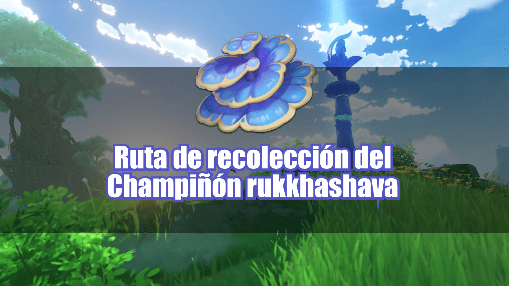

[Ruta de recolección del Champiñón rukkhashava](../14182248/article)

 

--Rutas para conseguir los materiales de mejora de personje

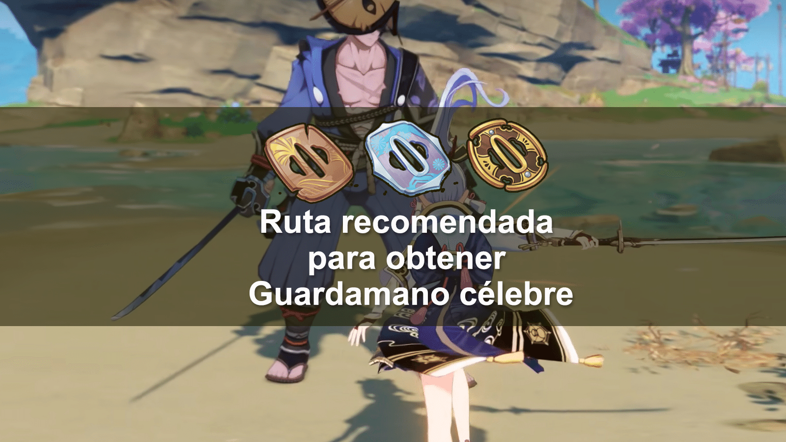

[Ruta recomendada para obtener Guardamano célebre](../13809760/article)

 

--La información y la historia sobre Trotamundos

 

#### **3. La Letrada Inocente: Yanfei**

**Yanfei**, personaje de 4*, Pyro, Catalizador. su coste de mejora es bajo, sus ataques son sencillos y fáciles de usar, lo que la hace perfecta para los novatos. Sin embargo, para los jugadores expertos que ya han adquirido muchos personajes y no carecen del atacante de Pyro, **Yanfei** apenas será útil y apenas supondrá un salto cualitativo para este grupo de jugadores. Con su regreso esta vez, pueden adquirirla bajo demanda.

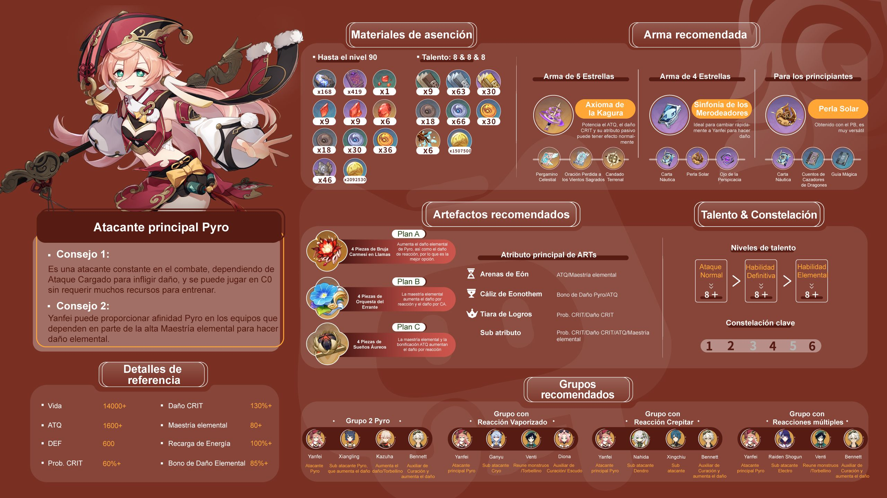

--Una #guía completa# sobre Yanfei: Sus habilidades, Armas, Artefactos y equipos recomendados

--Consejo de gacha & Guía de mejora

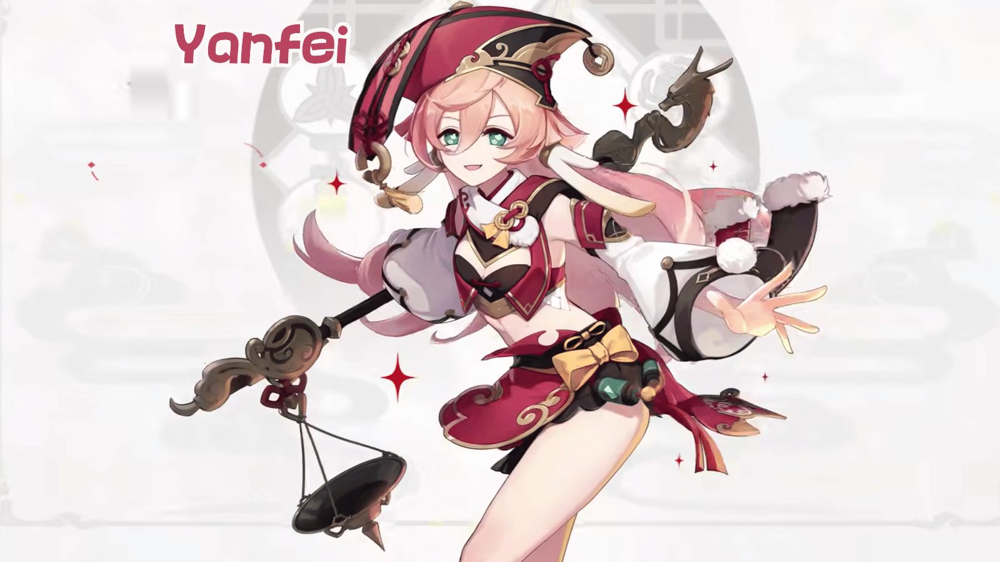

[Análisis de personaje y recomendaciones para obtener a [Yanfei]](../14156385/article)

 

--Una explicación detallada de Yanfei

[La guía más accesible de Yanfei en la red](../14162171/article)

 

--Rutas para conseguir el objeto típico que necesita

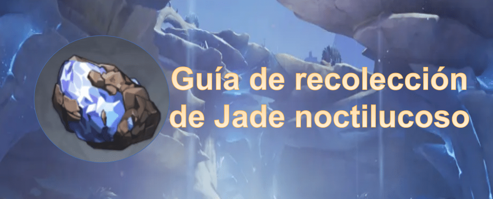

[Guía de recolección del Jade noctilucoso que incluso Paimon pueda entender](../12314203/article)

 

--Rutas para conseguir los materiales de mejora de personje

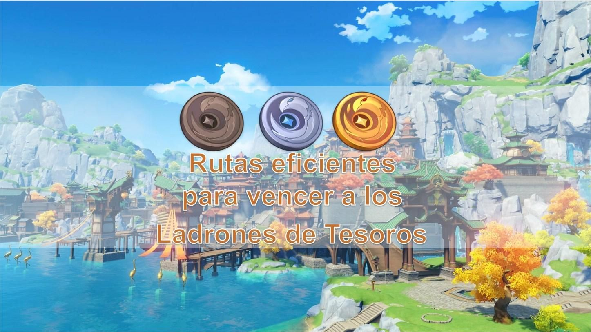

[Rutas eficientes para vencer a los Ladrones de Tesoros](../12308190/article)

 

#### **4. El General Canino: Gorou**

El adorable **Gorou** es un arco y un apoyo capaz de aumentar el daño. Es el apoyo del equipo de Geo y sus Cons son capaces de aumentar el daño del equipo de Geo significativamente con un menor coste de mejora. Es capaz de potenciar significativamente a Arataki Itto.

¡Se dice que tocar las orejas de **Gorou** te dará suerte!

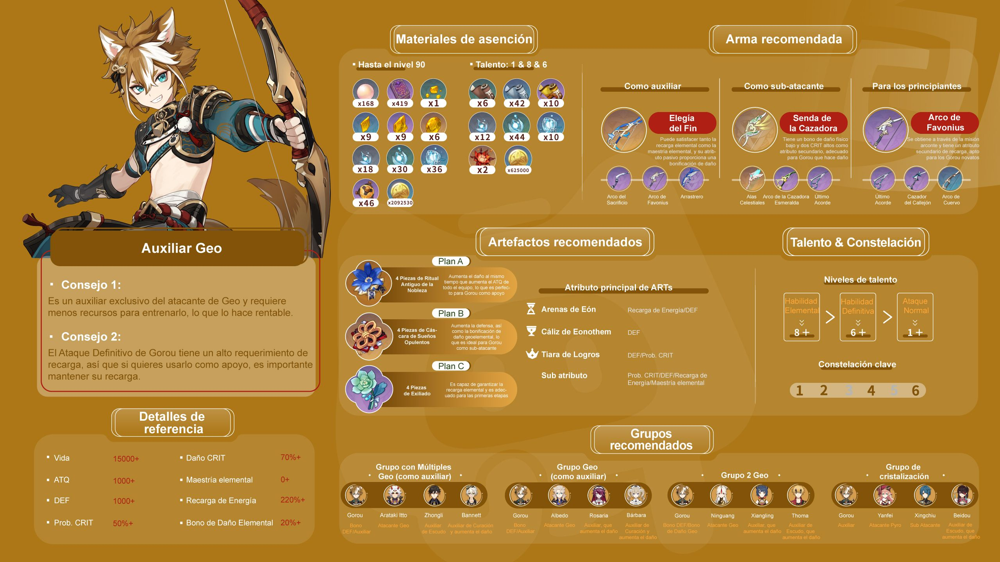

--Una #guía completa# sobre **Gorou**: Sus habilidades, Armas, Artefactos y equipos recomendados

--Consejo de gacha & Guía de mejora

[Análisis de fuerza del personaje y Recomendación de Gachapón y ----[Gorou]](../14156224/article)

 

--Una explicación detallada de Gorou

[【Guía de Personaje】Guía de entrenar a Gorou en todos los aspectos](../14162112/article)

 

--Rutas para conseguir el objeto típico que necesita

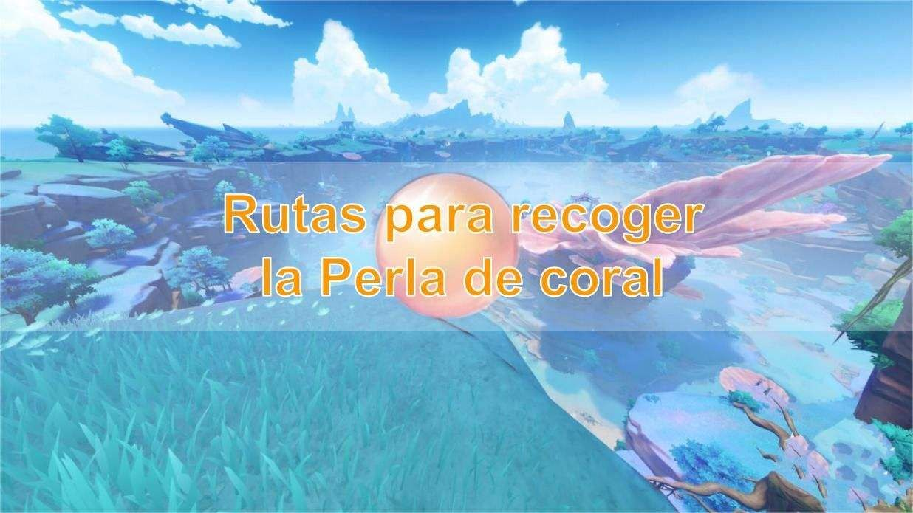

[Rutas para recoger la Perla de coral](../14172503/article)

 

--Rutas para conseguir los materiales de mejora de personje

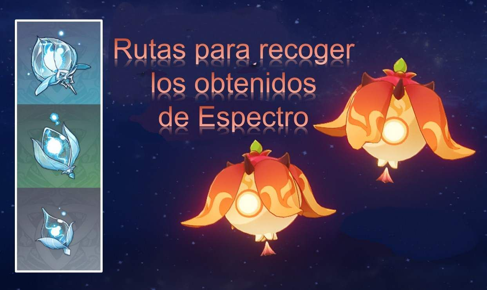

[Rutas para recoger los obtenidos de Espectro](../9423692/article)

 

#### **5. La Ingeniera Enigmática: Faruzán**

La nueva personaje 4* **Faruzán** es un personaje de arco, elemental de Anemo, posicionado como apoyo elemental de Anemo y capaz de reunir monstruos, viene de Sumeru.

También he preparado una serie de consejos para los que les guste este nuevo personaje:

 

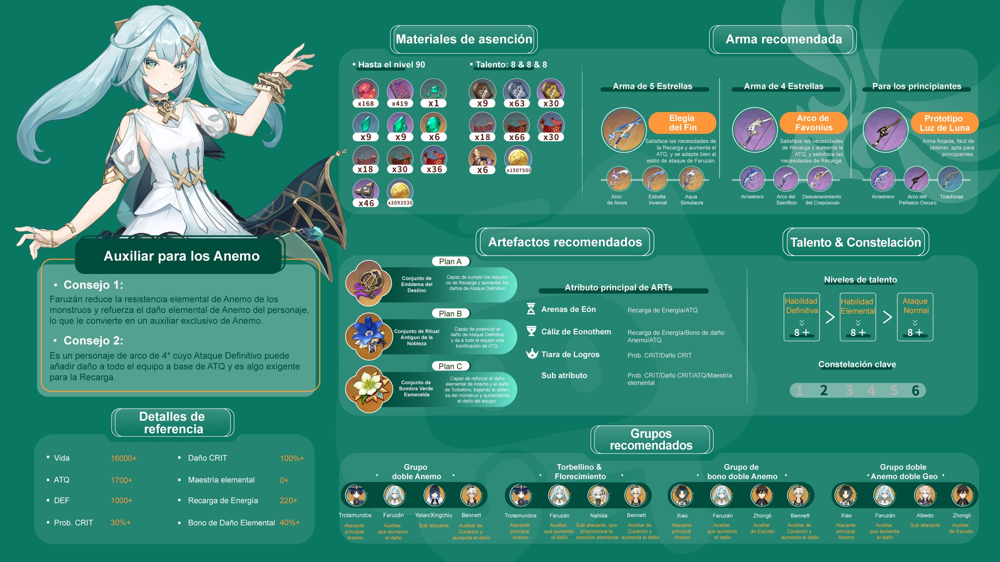

--Una #guía completa# sobre Faruzán: Sus habilidades, Armas, Artefactos y equipos recomendados

--Consejo de gacha & Guía de mejora

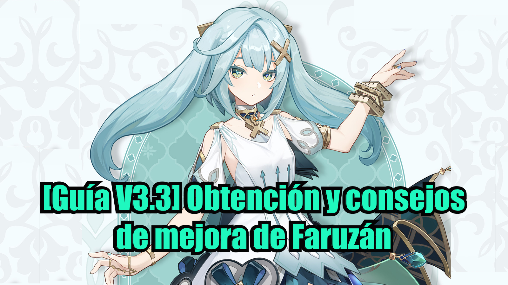

[**[Guía V3.3] Obtención y consejos de mejora de Faruzán**](../14214772/article)

--Una explicación detallada de Faruzán

--Rutas para conseguir el objeto típico que necesita

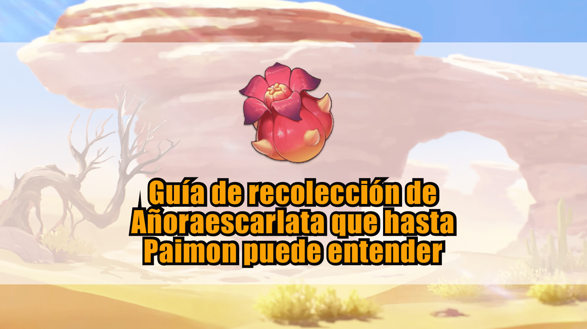

[Guía de recolección de Añoraescarlata que hasta Paimon puede entender](../9980467/article)

 

--Rutas para conseguir los materiales de mejora de personje

[Rutas contra los Eremitas: tan sencilla que hasta Paimon puede entenderlas](../9431062/article)

Version: [zh-tw](../14183709/article)/[ja-jp](../14184074/article)/[en-us](../14184039/article)/[es-es](../14183919/article)/[ru-ru](../14184353/article)[it-it](../14184589/article)/[tr-tr](../14184841/article)

