The card pool of the first half of V3.3 has been released and is waiting for the gems. This time the pool contains two 5-Star characters, **Arataki Itto** and **the Wanderer (Scaramouche)**, two 4-Star characters, **Yanfei **and **Gorou**, and a new 4-Star character, **Faruzan**. According to the according to g****vine, the new character is a new “Anemo Daddy” and a literally “natural daughter” of GI; she and **the Wanderer (Scaramouche)** are also called “Anemo Twins”. True or not. We travelers can draw and see!

 

	

Here I specially collect the guides of some selected character cards in the card pool of the first half of V3.3:

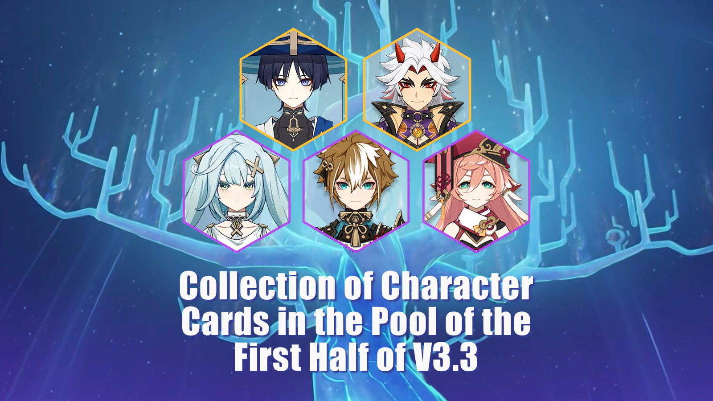

#### **1. [Hanamizaka Heroics] Arataki Itto**

**Arataki Itto** is a 5-Star Geo character using Claymore. He barely participates in Elemental Reactions, but he is a main carry in the field with high DMG. **Arataki Itto **has outstanding performance even with 0 Constellation and his exclusive weapon is in T1 as well. Players who are lack of main carry can collect this card with no doubt.

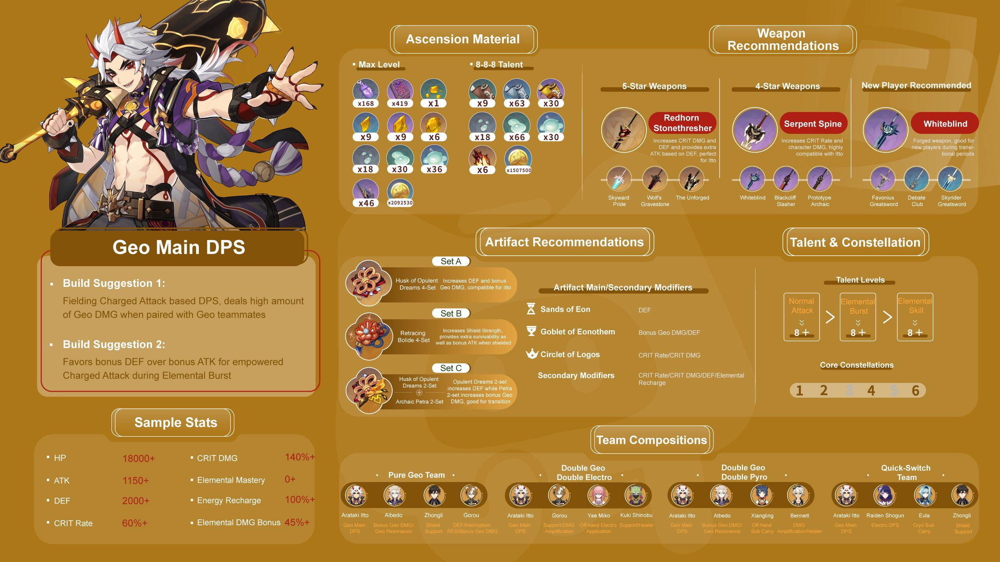

	

--[One Figure] #Character Guides# Arataki Itto (Mechanics/Equipment Selection/Comps)

 

--Guides of the Route of Upgrade Materials Collection

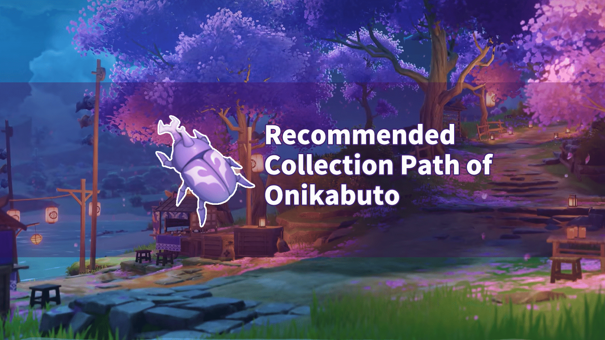

[**Recommended Collection Path of Onikabuto**](../13783205/article)

 

 

--Textual Research of the Setting of Arataki Itto

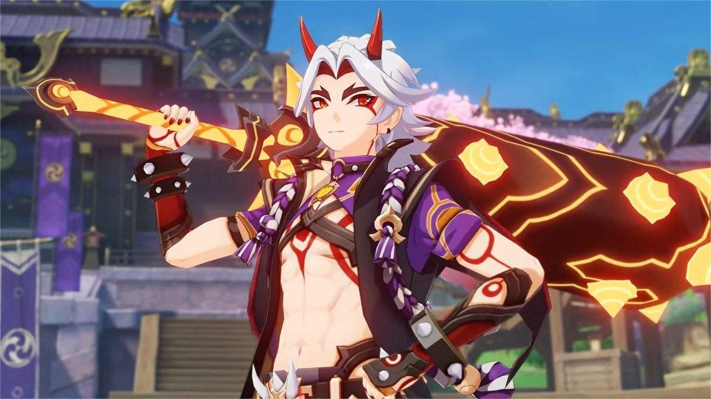

[**Arataki Itto Character Origins**](../14090660/article)

#### **2. [Eons Adrift] The Wanderer (Scaramouche)**

	

**The Wanderer** is Scaramouche. In the story line of V3.2, he used Electro Gnosis and worked himself a new god in a huge mechanical suit. After being purified by the power of Dendro Archon, Scaramouche awoken and became the second Fatui Skirmisher who joined the Traveler. In short, the Wanderer is whitewashed Scaramouche.

 

	

He is essentially a rare 5-Star Anemo main carry with high-efficiency of DMG and levitation skill. [Levitation skill] is a unique feature. It makes **the Wanderer **almost a “bug” in map exploration and fight. Don’t miss and regret!

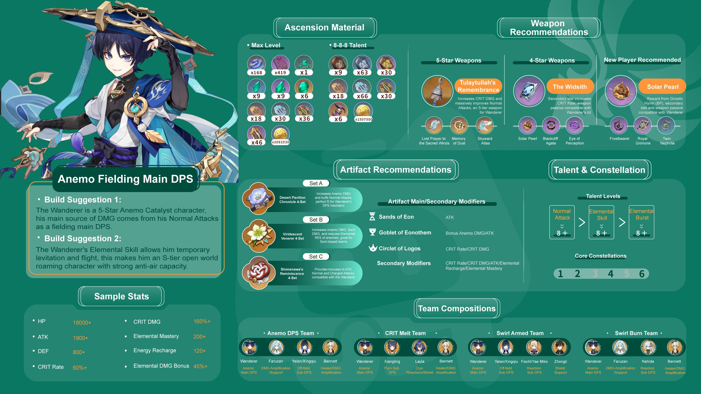

 

--[One Figure] #Character Guides# the Wanderer (Mechanics/Equipment Selection/Comps)

 --Guides of Draw & Upgrade

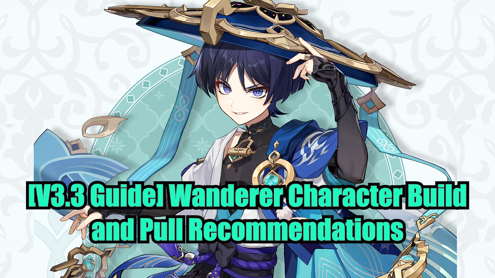

[**[V3.3 Guide] Wanderer Character Build and Pull Recommendations**](../14215584/article)

--Guides of the Route of Upgrade Materials Collection

[**Rukkhashava Mushrooms Collection Route Guide**](../14182036/article)

 

--Guides of the Route of Boss Mission for Upgrade Materials

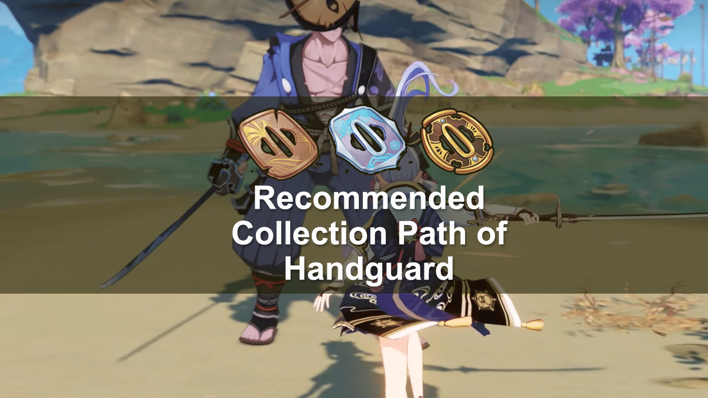

[**Recommended Collection Path of Handguard**](../13809578/article)

--Textual Research of the Setting of the Wanderer

#### **3. [Wise Innocence] Yanfei**

**Yanfei** is a 4-Star Pyro character using Catalyst. The upgrade and operation of Yanfei are relatively easy, so this card is very suitable for new players. However, for players who have sufficient character cards including sufficient Pyro cards, it seems hard to find a suitable comp for **Yinfei**- it’s a character with low ceiling and high floor. Players can draw as needed for her encore.

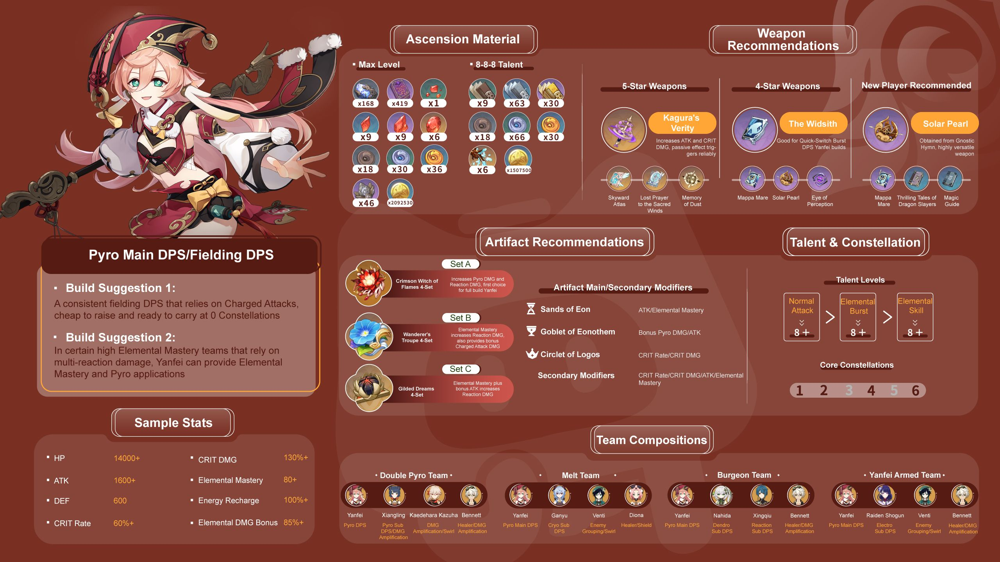

 

--[One Figure] #Character Guides# Yanfei (Mechanics/Equipment Selection/Comps)

 

--Guides of Draw & Upgrade

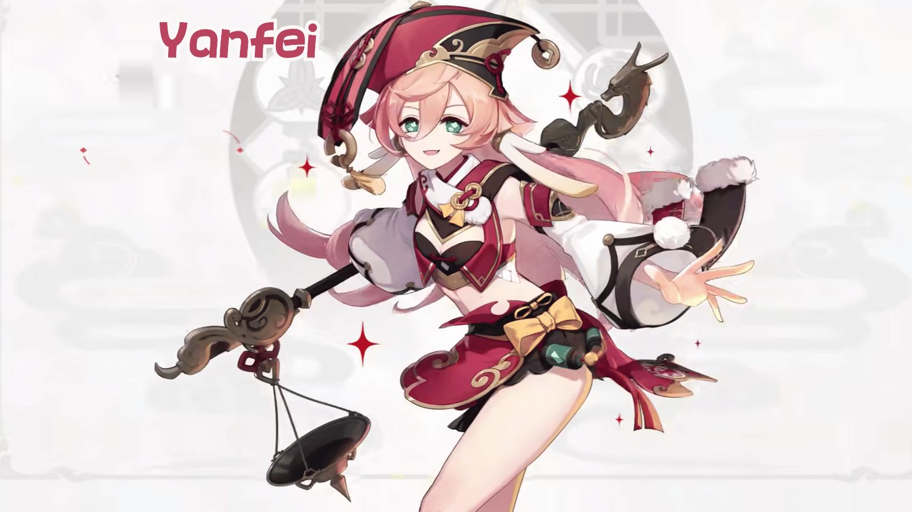

[**Character Strength Analysis and Pull Suggestion – [Yanfei]**](../14155884/article)

 

--Detailed Analysis of Character

[**The Most Concise Yanfei In-Depth Guide on the Internet**](../14154390/article)

 

--Guides of the Route of Upgrade Materials Collection

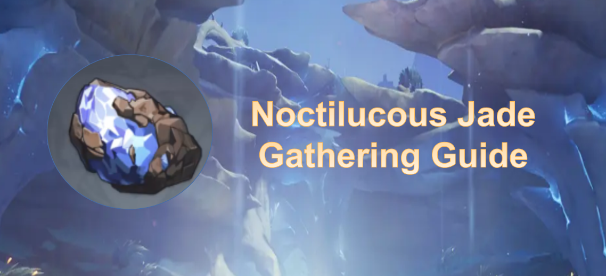

[Even Paimon Can Do This! - Noctilucous Jade Farm Guide](../12313483/article)

--Guides of the Route of Boss Mission for Upgrade Materials

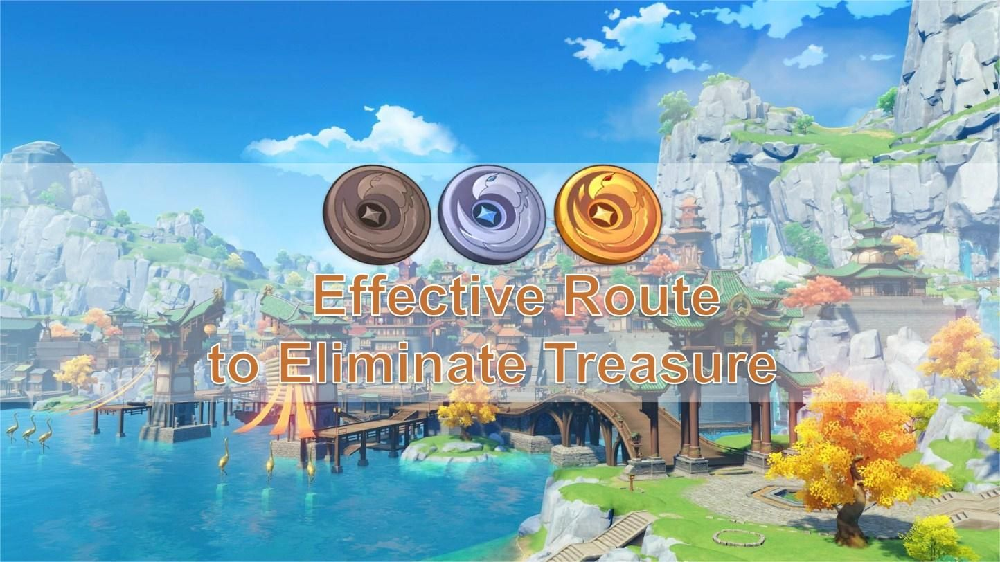

[**How to Eliminate Treasure Hoarders Effectively**](../12306901/article)

#### 

#### **4. [Canine Warrior] Gorou**

The lovely **Gorou** can increase the DMG of his team. He is a Geo SUP character using bow. With high Constellation, he can greatly improve the DMG of a Geo team. The cost of upgrading is relatively low. Comping Arataki Itto leads to significantly improvement.

 

It is said stroking **Gorou**’s ears could bring good luck!

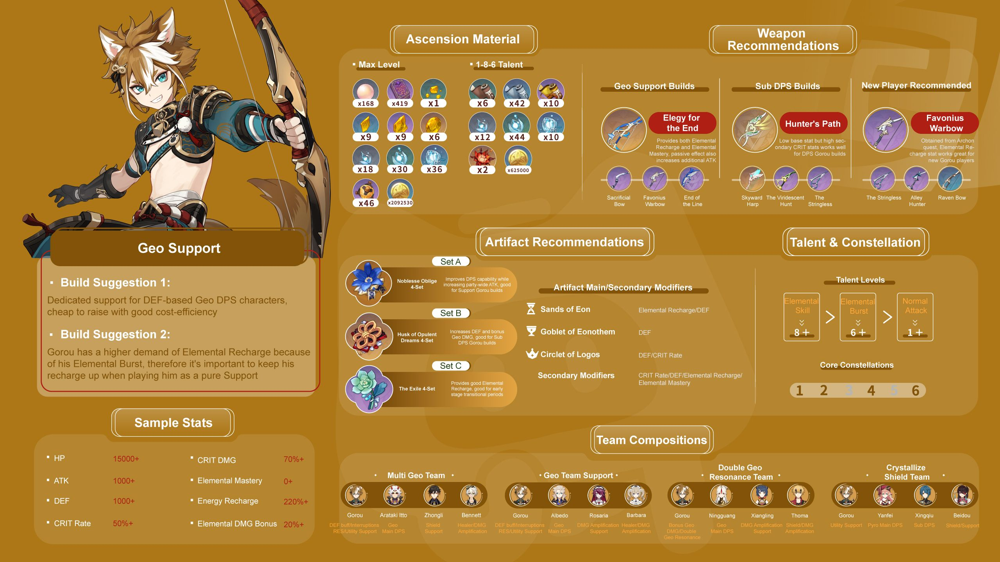

	 

--[One Figure] #Character Guides# **Gorou** (Mechanics/Equipment Selection/Comps)

 

--Guides of Draw & Upgrade

[**Analysis of Combat Power and Drawing Advice: Goro**](../14156027/article)

 

--Detailed Analysis of Character

[**[Character Guide] All-Round Guide for Gorou’s Build**](../14155682/article)

 

--Guides of the Route of Upgrade Materials Collection

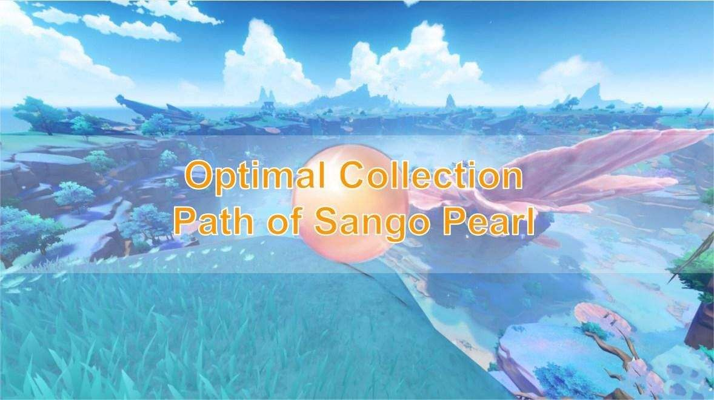

[**Optimal Collection Path of Sango Pearl**](../14172372/article)

 

--Guides of the Route of Boss Mission for Upgrade Materials

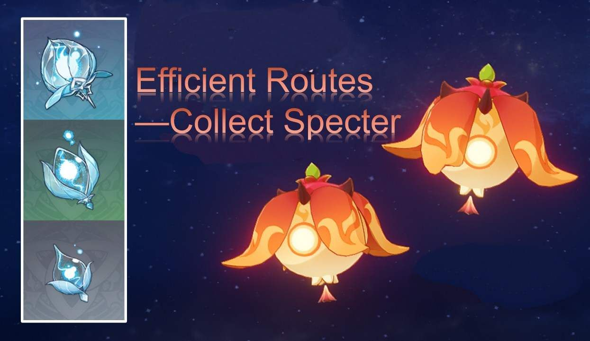

[**Specter Farm Routes**](../9421212/article)

#### **5. [Enigmatic Machinist] Faruzan**

	

**Faruzan** is a new 4-Star Anemo character using bow. She comes from Sumeru and is defined as Anemo & boss gathering SUP.

 

	

We also prepared a series of guides for travelers who are fond of this new character:

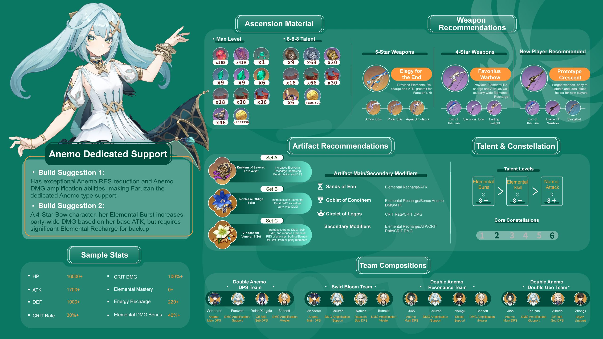

 

--[One Figure] #Character Guides# Faruzan (Mechanics/Equipment Selection/Comps)

 

--Guides of Draw & Upgrade

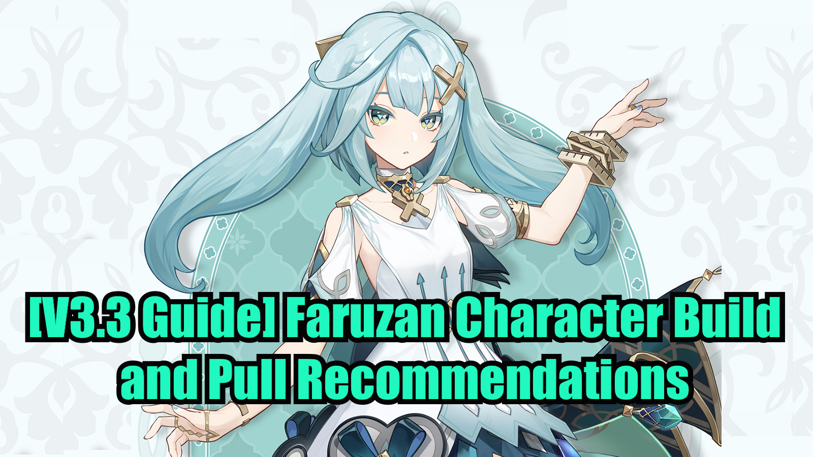

[**[V3.3 Guide] Faruzan Character Build and Pull Recommendations**](../14214460/article)

--Detailed Analysis of Character

--Guides of the Route of Upgrade Materials Collection

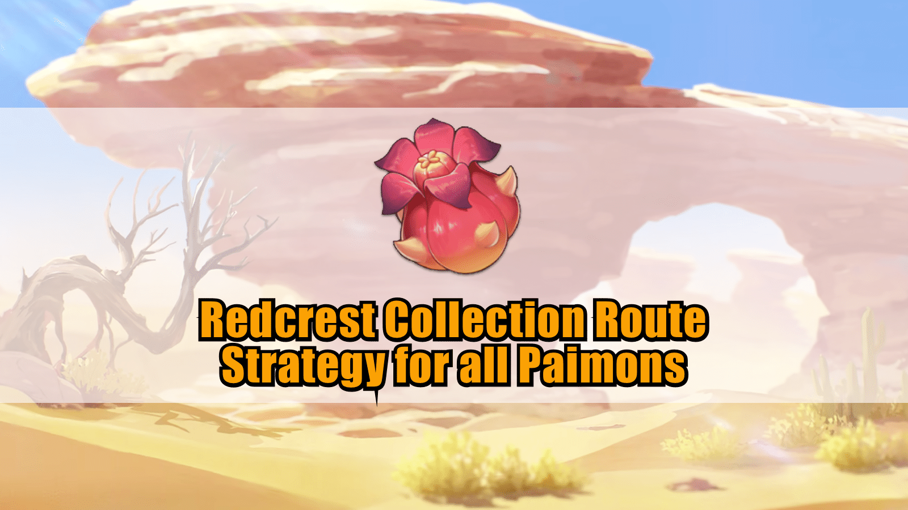

[Redcrest Collection Route Strategy for all Paimons](../9977641/article)

--Guides of the Route of Boss Mission for Upgrade Materials

[**Even Paimon Can Do This! - The Eremites Farm Routes**](../9428838/article)

Version: [zh-tw](../14183709/article)/[ja-jp](../14184074/article)/[en-us](../14184039/article)/[es-es](../14183919/article)/[ru-ru](../14184353/article)[it-it](../14184589/article)/[tr-tr](../14184841/article)

 

