Новые карты персонажей из первой половине версии 3.3 израсходуют ваши камни Истока! В этот раз кроме двух пятизвездочных персонажей Итто и Странник (скарамучча), 2 4-звездочных персонажей Янь Фэй и Горо мы еще встретим новую лучницу Фарузан. Говорят, что она очень сильная Анемо, можете считать дочерью разработчика, оба персонажа Анемо она и Странник вместе играют важную роль в отряде, одного без другого не существует, а это верно или нет, нужно путешественникам самим разблокировать их!

Здесь мы готовили вам следующие гайды по вышеупомянутым персонажам.

#### «Герой Ханамидзаки» Аратаки Итто

--[Баннеры] #Гайд по персонажу# Итто (Способности/выбор экипировки/отряд)

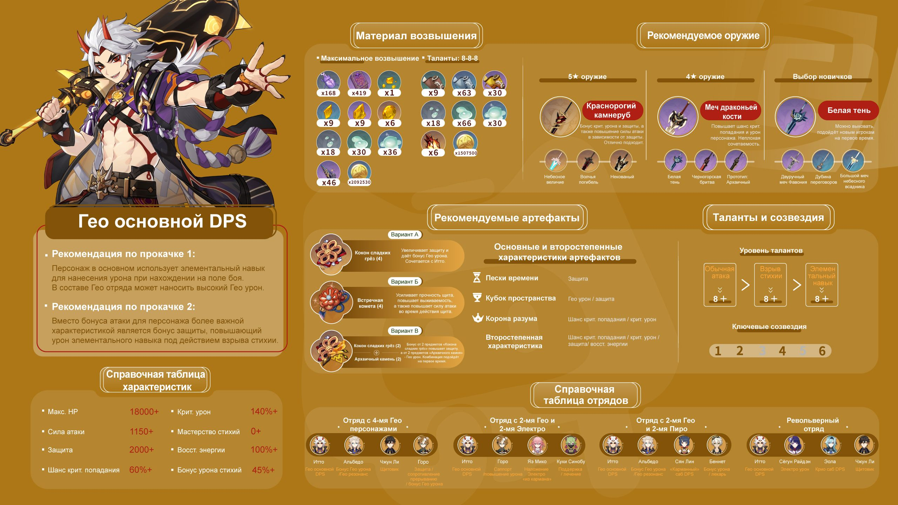

--Руководство по сбору материалов для развития

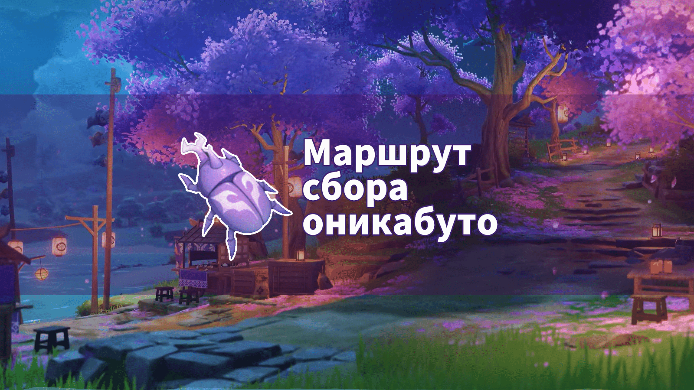

[Маршрут сбора оникабуто](../13783105/article)

--Источники персонажа Итто 

[Анализ образа персонажа Итто](../14090451/article)

#### «Затерявшийся в вечности» Странник (скарамучча)

По сюжетной линии версии 3.2 мы узнаем о том, как Скармучча стал странником, он использовался Гнозисом Баала и стал богом в виде пилотируемого большого меха. После очистки Нахиды Скармучча проснулся и стал вторым предвестником Фатуи, который превратился в путешественника, в общим, странник - переосмысленный Скармучча.

В сущности, он является уникальном 5-звездочном персонажем Анемо, играющим предварительную роль в отряде: постоянный выбранный дамагер. Он отличается нанесением большого урона, поражением врагов с воздуха и т.д. При передвижении по карте и убийстве противников Странник может подлетать вверх на собственной стамине, не пожалеешь упущения такого неуязвимого персонажа с единственным навыком.

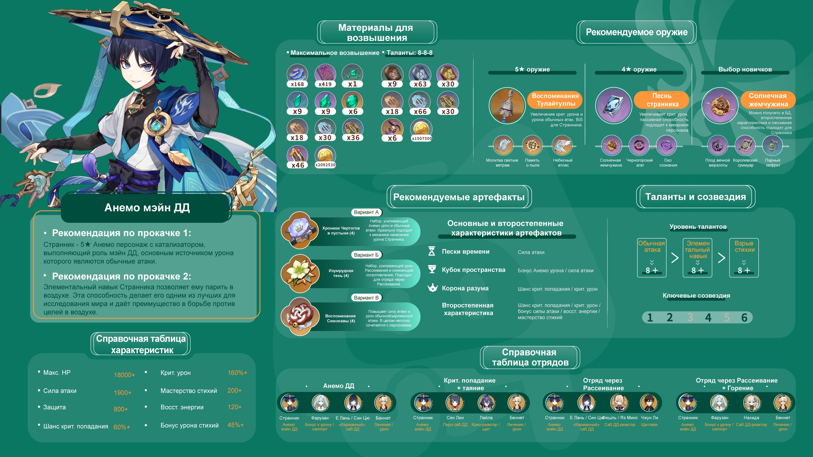

--[Баннеры] #Гайд по персонажу# Странник (Способности/выбор экипировки/отряд)

--Руководство по получению и прокачки персонажа

[**【Стратегия верссии 3.3】рекомендация по извлечению и повышению персонажа Странник**](../14217071/article)

--Руководство по сбору материалов для развития

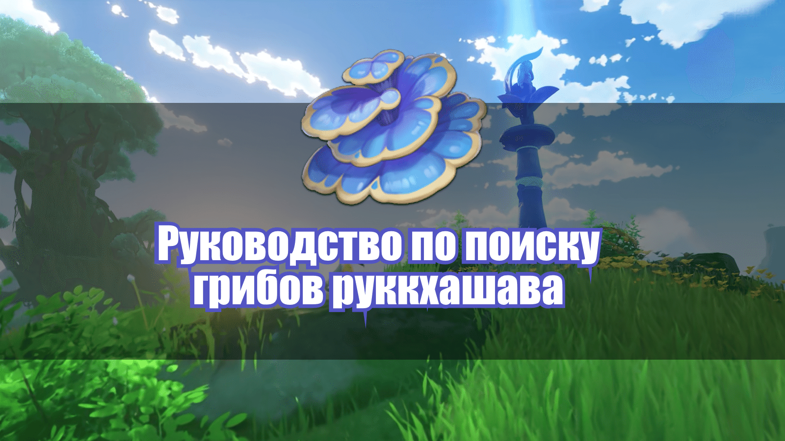

[Руководство по поиску грибов руккхашава](../14182401/article)

--Руководство по получению материалов от монстров для развития

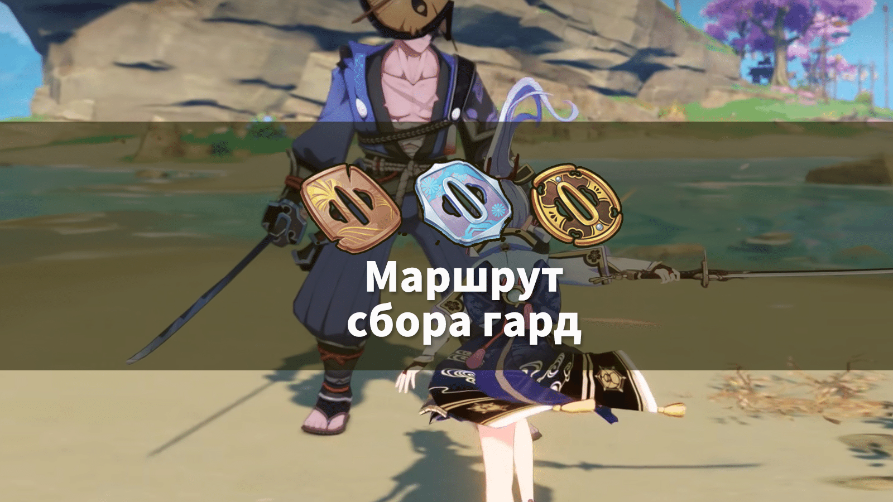

--Источники персонажа Странник

#### «Знаток законов» Янь Фэй

Янь Фэй является 4-звездочным персонажем Пиро с катализатором, вы можете развивать ее без большой траты, для новичков легко использовать на поле боя и прямо наносить урон. Так как количество ****ов отряда ограниченнное, хотя немало опытных игроков не имеет основного Пиро дамагера, но она не выдающийся персонаж с низким лимитом развития и малыми доходами, поэтому поставили Янь Фэй в неловкое положение, трудно есть возможность показать себя. 

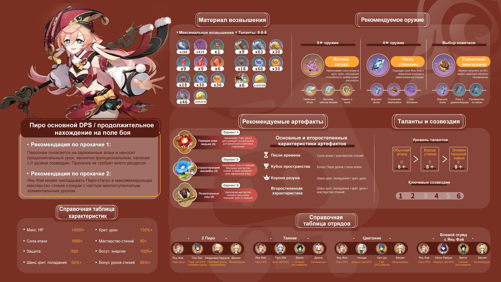

--[Баннеры] #Гайд по персонажу# Янь Фэй (Способности/выбор экипировки/отряд)

--Руководство по получению и прокачки персонажа

[Анализ силы персонажа и предложения по добыче - Янь Фэй](../14153661/article)

--Анализ персонажа

[Самое доступное хардкорное руководство по Янь Фэй](../14153467/article)

--Руководство по сбору материалов для развития

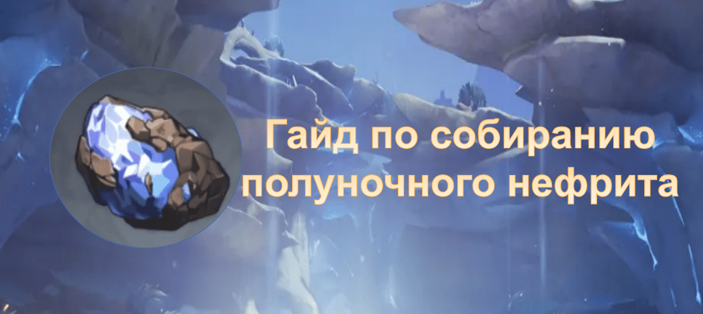

[Гайд по собиранию полуночного нефрита, который может понять даже Паймон](../12314987/article)

--Руководство по получению материалов от монстров для развития

[Маршрут фарма материалов Похитителей сокровищ](../12308529/article)

#### «Собачий воин» (canine warrior) Горо

Милый парень Горо является Гео сап-лучником, который усиливает огромные бонусы к урону в отряде Гео, при высоким уровнем созвездия Горо даёт эффект и усиления активному персонажу в области действия штандарта в зависимости от числа персонажей Гео в отряде. Кроме того, без немногой траты можно прокачать его с разных сторон, в особенноси, соединение с Итто оказывает динамичный рост сил.  

Говоря, что гладить Горо по ушам принести счастье!

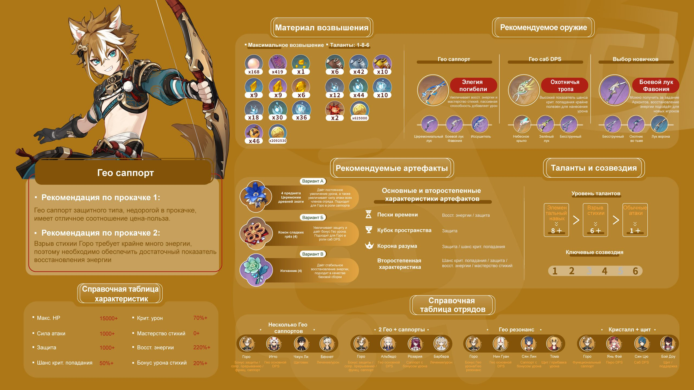

--[Баннеры] #Гайд по персонажу# Горо (Способности/выбор экипировки/отряд)

--Руководство по получению и прокачки персонажа

--Анализ персонажа

[【Стратегия о персонаже】Всесторонняя стратегия по повышению Горо](../14153425/article)

--Руководство по сбору материалов для развити

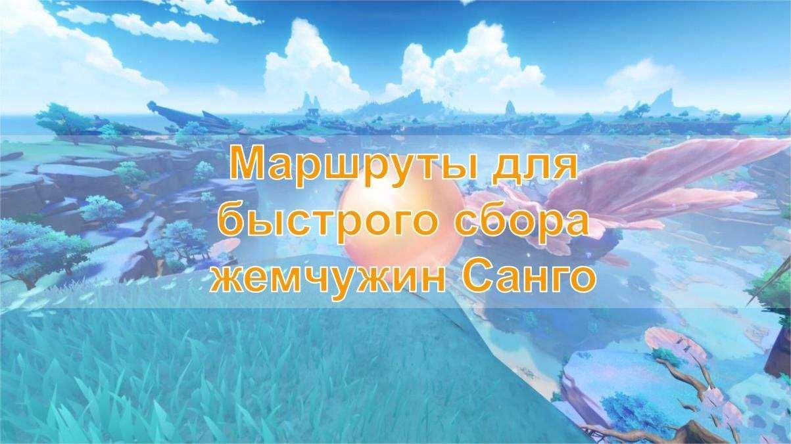

[Маршруты для быстрого сбора жемчужин Санго](../14172605/article)

--Руководство по получению материалов от монстров для развития

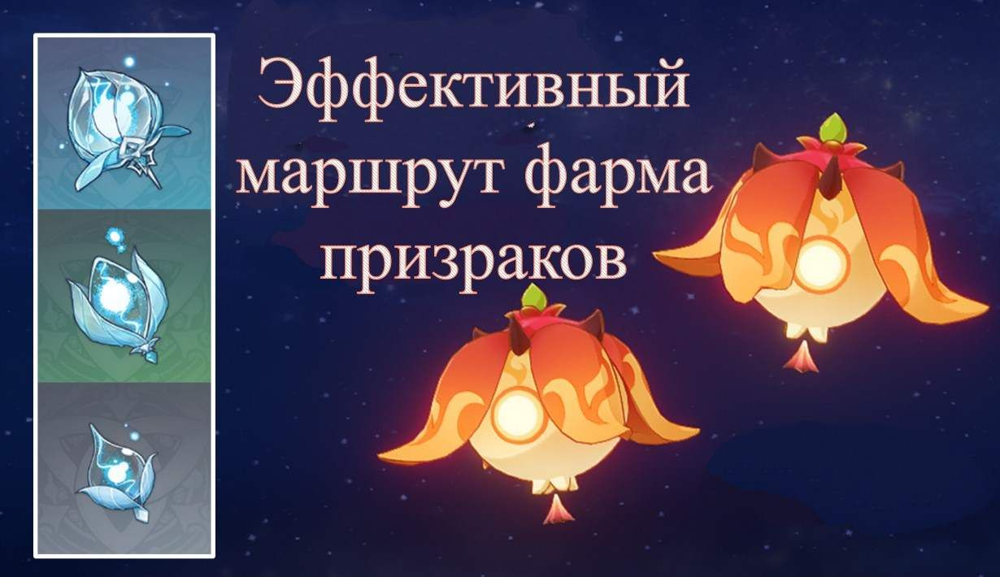

[Эффективный маршрут фарма призраков](../9425405/article)

#### «Загадочный механик» Фарузан

Новый 4-звездочный персонаж Анемо Фарузан из региона Сумеру, в качестве лучницы играет предварительную роль: сап-дд с Анемо элементом.

Мы еще готовили серию гайдов на такой любимый персонаж:

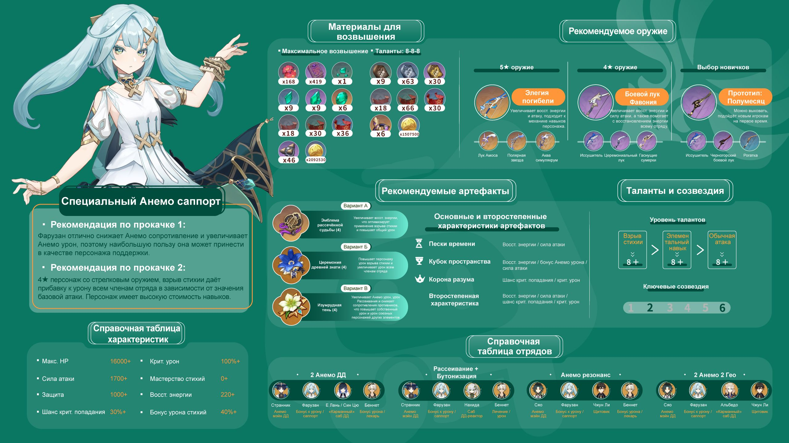

--[Баннеры] #Гайд по персонажу# Фарузан (Способности/выбор экипировки/отряд)

--Руководство по получению и прокачки персонажа

[**【V3.3 полное руководство】Советы по добыче и развитию персонажа Фарузана**](../14213777/article)

--Анализ персонажа

--Руководство по сбору материалов для развития

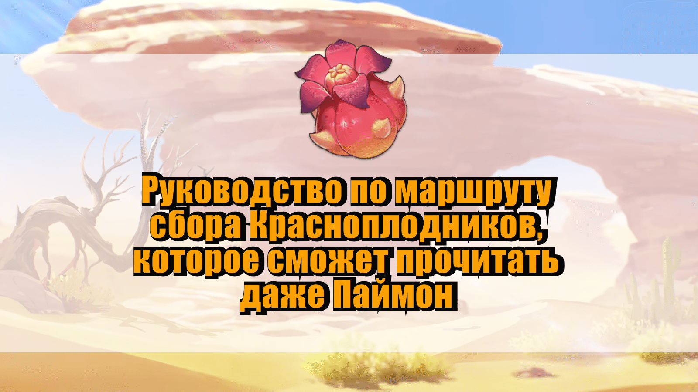

[Руководство по маршруту сбора Красноплодников, которое сможет прочитать даже Паймон](../10001788/article)

--Руководство по получению материалов от монстров для развития

[Маршрут военной экспедиции [Пустынников], который может понять даже Паймон](../9433199/article)

Version: [zh-tw](../14183709/article)/[ja-jp](../14184074/article)/[en-us](../14184039/article)/[es-es](../14183919/article)/[ru-ru](../14184353/article)[it-it](../14184589/article)/[tr-tr](../14184841/article)

