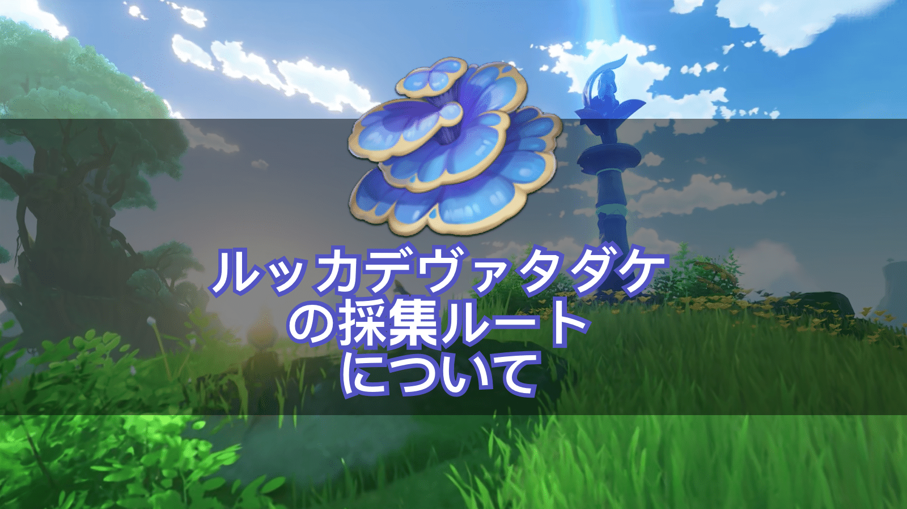
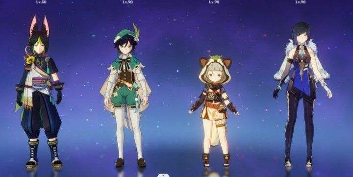
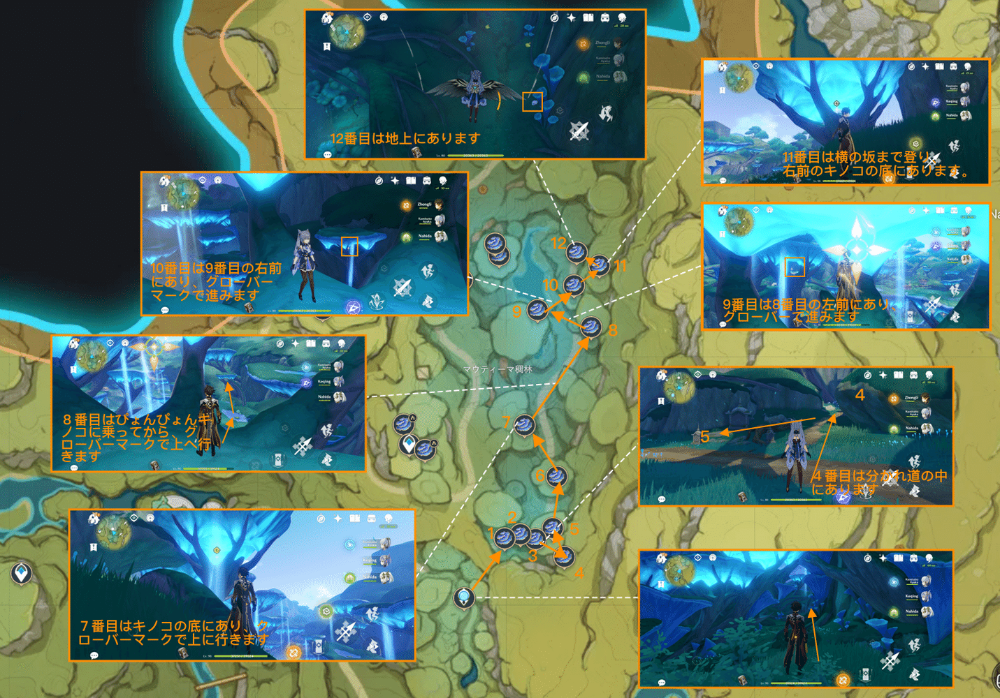
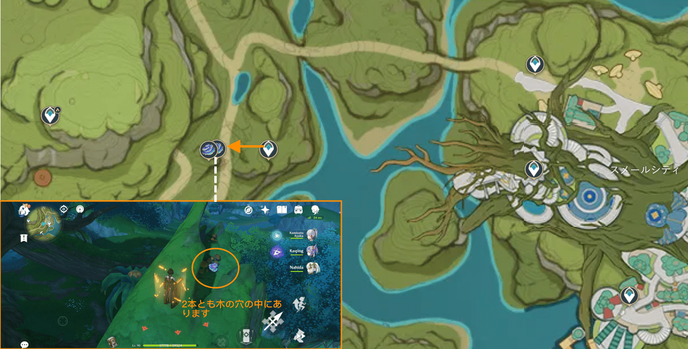
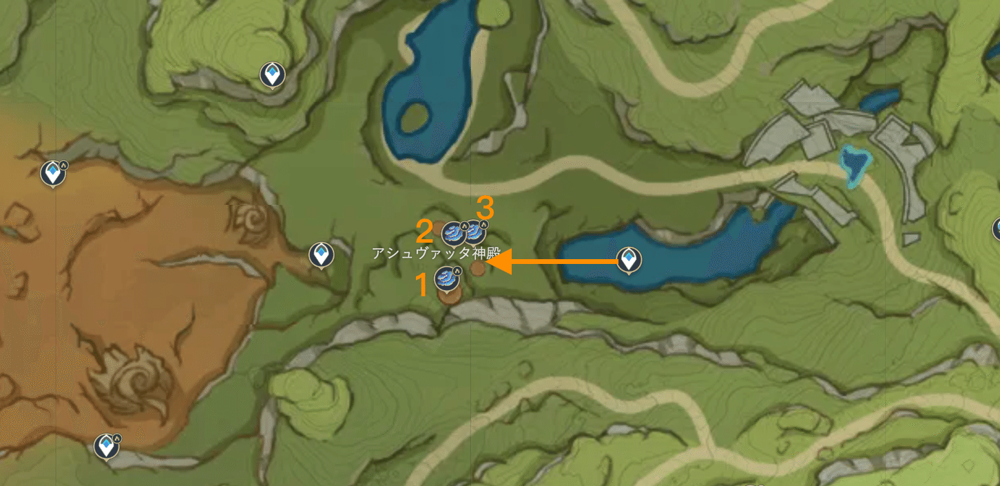
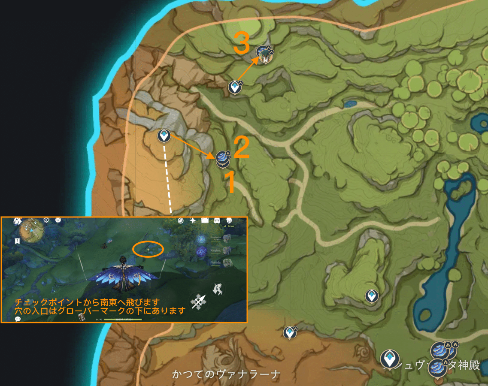
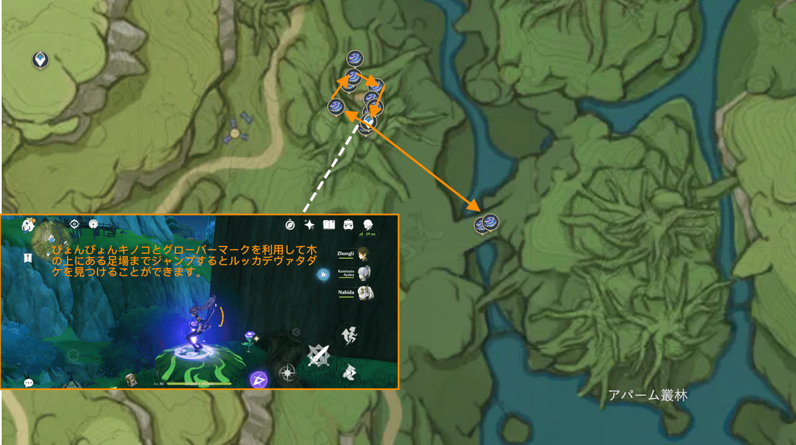
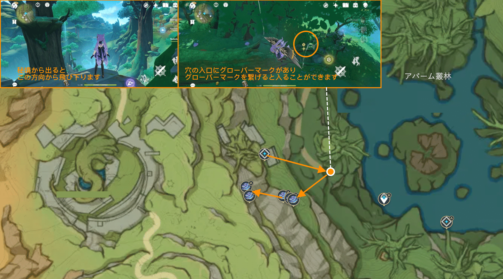
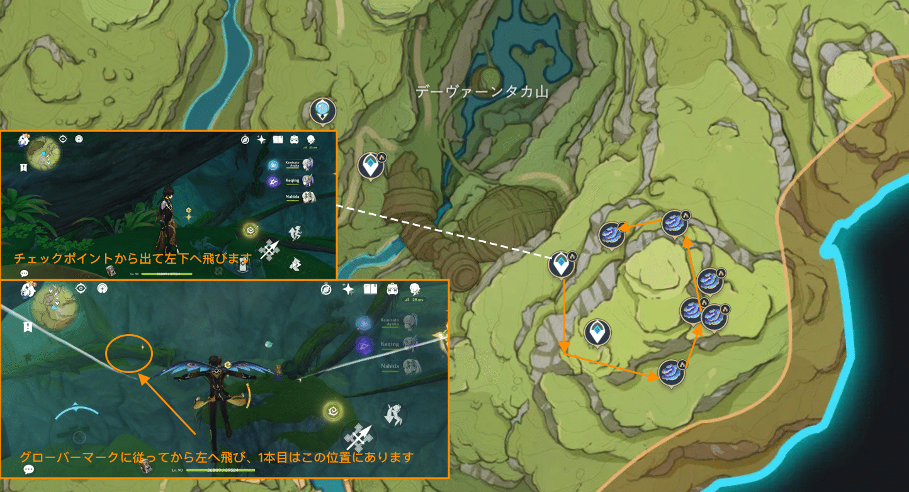

**コレイの突破素材の一つであるルッカデヴァタダケの入手場所を知らない方が多いはずです。皆さんの素材採集を手伝うため、今回はルッカデヴァタダケの分布位置についてご説明したいと思います。**

**ルッカデヴァタダケの更新時間：48時間**

**採集チーム編成：（食べ物選択：スタミナの消費が軽減される風神ヒュッツポット）**

**1、****ティナリ****の天賦はミニマップで周囲のスメール地域の特産の位置を表示します。**

**2、****ウェンティ+早柚****で移動速度を上げ、スタミナの消費を軽減します（万葉を所持した場合は優先して編成しましょう）**

**3、****夜蘭****のスキルで走る**

 

Ø  **一つ目の場所：マウティーマ稠林で24個採集可能**

Ø  **二つ目の場所：スメールシティの左側で2個採集可能**

** **

Ø  **三つ目の場所：縁覚の塔で3個採集可能**

Ø  **四つ目の場所：砂漠へのワープポイント**

Ø  **五つ目の場所：アパーム叢林の左上で9個採集可能**

 Ø  六**つ目の場所：アパーム叢林の右下、左下で14個採集可能**

 Ø  七**つ目の場所：デーヴァーンタカ山の遺跡の竜獣山頂で6個採集可能**

**放浪者**をレベル90まで突破させるには、ルッカデヴァタダケが168個必要です。48時間おきに採集しても、フレンドの世界に入って採集しても良いですが、突破が急がない場合、マウティーマ稠林の周辺でゆっくり採集しても良い。

Version: [zh-tw](../7943227/article)[ja-jp](../7955164/article)[es-en](../14183087/article)[es-es](../14182248/article)[ru-ru](../14182401/article)[tr-tr](../14181659/article)[it-it](../14182565/article)

#### 

#### 

