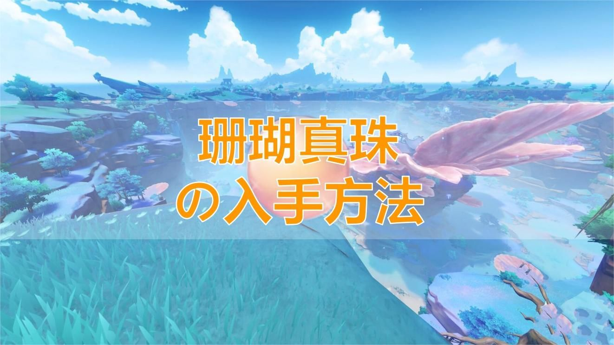
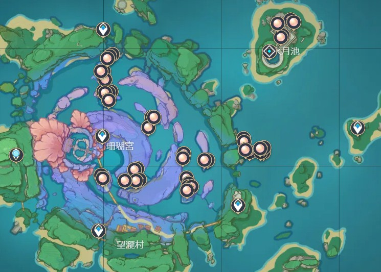
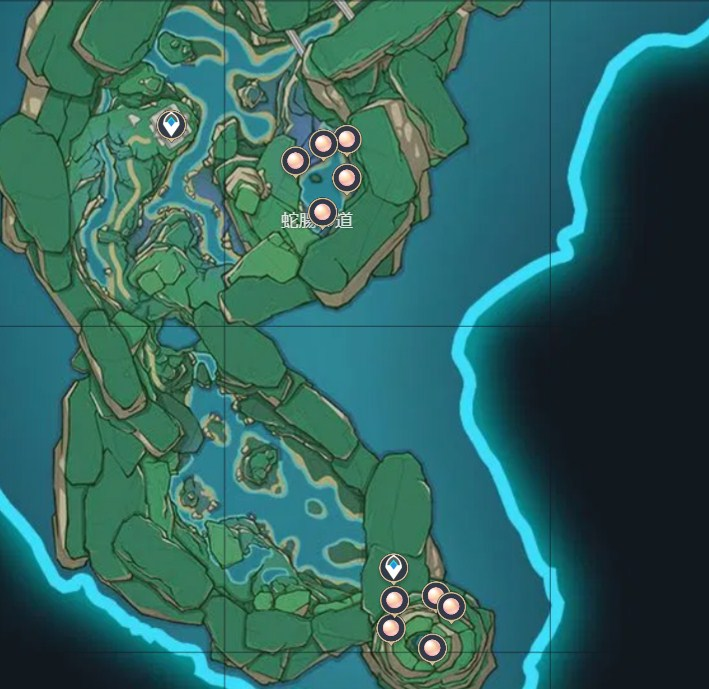
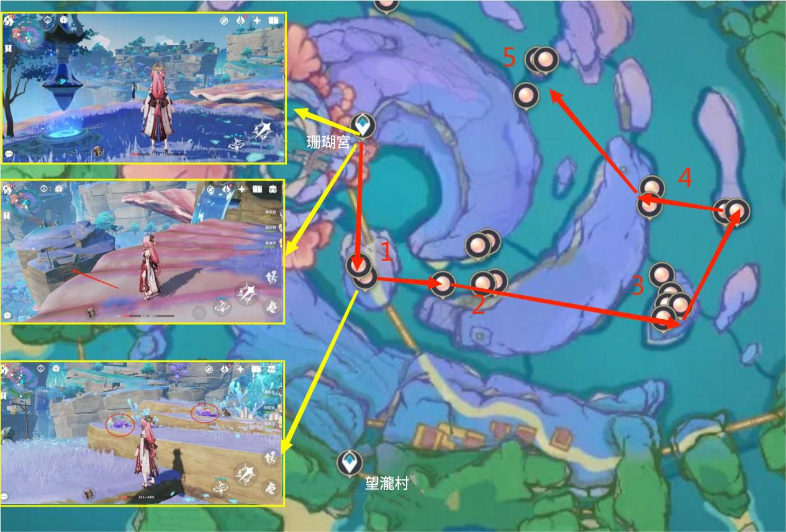
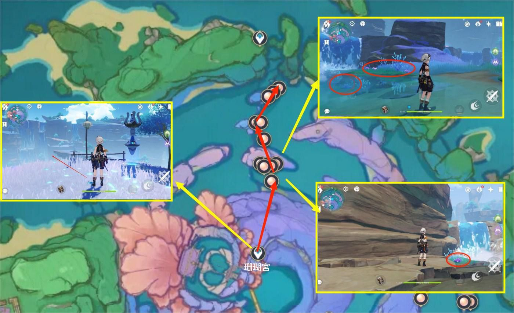
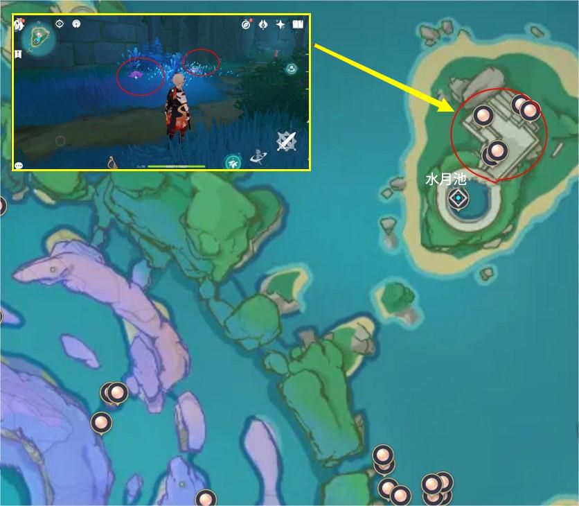
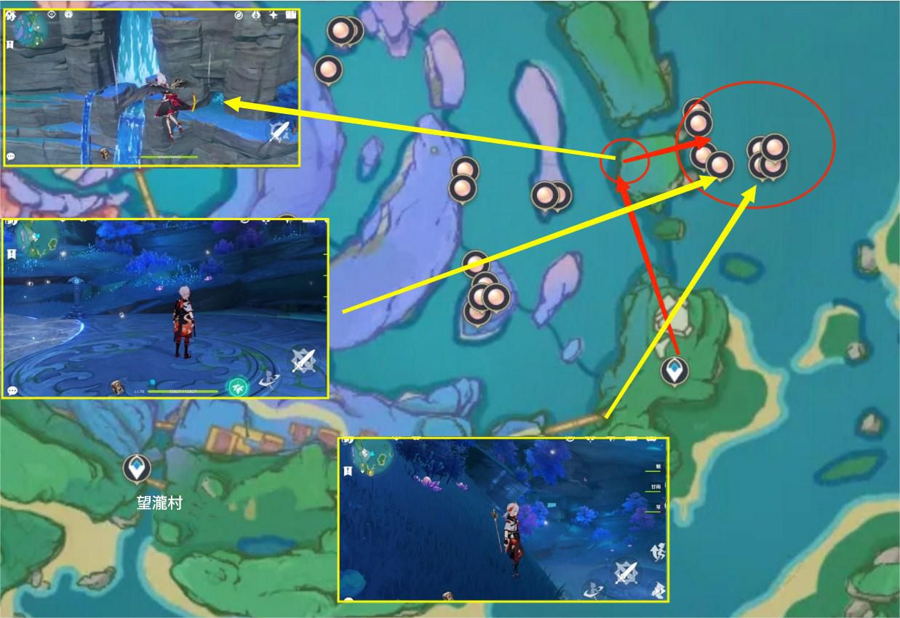
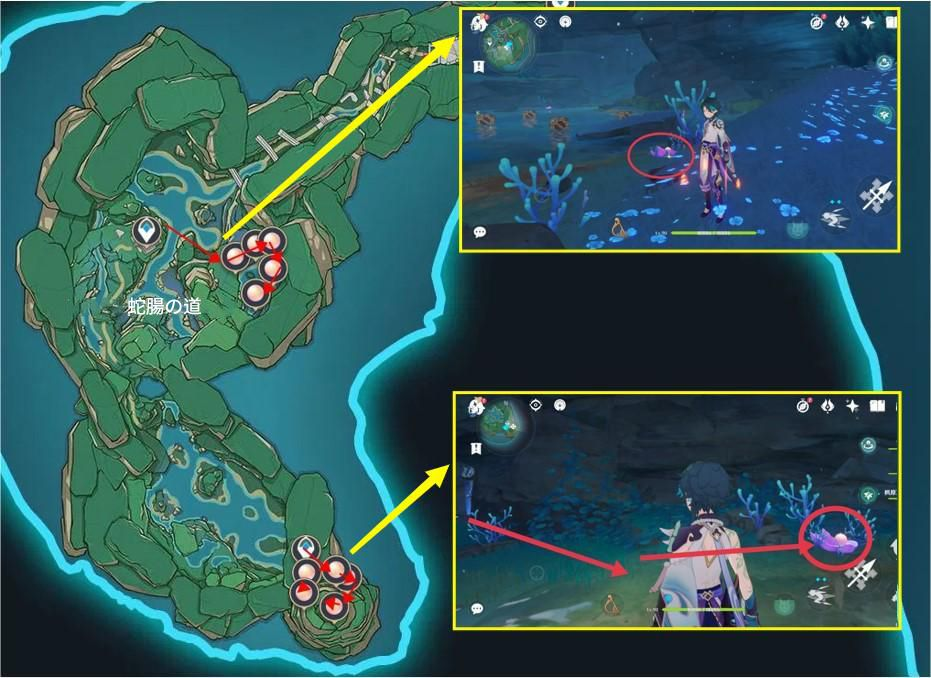
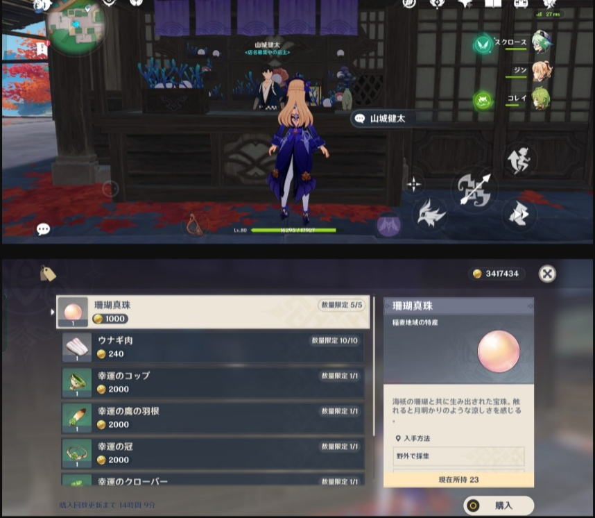

**珊瑚真珠**は心海の**突破**素材として、旅人が自分から収集する必要があります。今回の攻略を参考にして、珊瑚真珠を素早く集めましょう。

#### **【場所】**

珊瑚真珠は**稲妻エリアの特産品**として主に**珊瑚宮**と****淵下宮****で入手できます。ワープを上手く利用すれば容易に入手できます。

#### **【入手ルート】**

**ルート1**

１番目の場所から**ワープポイント**で橋から進めば到着できます。２番目の場所へは**崖**から飛び降りると到着できます。次の場所はルートに沿って進めば到着できます。

**ルート2**

図のルートから**崖**に沿って進めば珊瑚真珠を入手できます。

**ルート3**

水月池の**秘境**をアンロックすると、秘境の向いに珊瑚真珠が数個あります。中へ入るともっと多くあります。

**ルート4**

珊瑚宮の外部にある緑色の**崖の下**に、8個あります。

淵下宮は主に**ワープポイント**の*くにあります。図のルートに沿って進めば容易に見つけられます。

#### 【その他入手方法】

上記の6ルートで合計54個の珊瑚真珠を入手できます。もっと必要であれば**にいる山城健太から5個**購入**できます。購入数は**72時間**ごとに1度リセットされます。

珊瑚真珠はワールドマップの素材で、**48時間**ごとに1度リセットされます。短時間で大量の珊瑚真珠を入手したい場合は、**フレ****ンドワールド**で収集することもできます。

#### **【まとめ】**

珊瑚真珠は他の素材と比べ**レア**素材といえます。しかし心海がランク90を突破するのに大量の珊瑚真珠が必要になります。**心海と五郎を突破**させたい旅人は、早めに収集することをおすすめします。攻略を参考に、効率よく珊瑚真珠を集めましょう～

Version：[zh-tw](../8397727/article)/[ja-jp](../8471110/article)/[en-us](../14172372/article)/[es-es](../14172503/article)/[ru-ru](../14172605/article)/[tr-tr](../14172712/article)/[it-it](../14173580/article)

