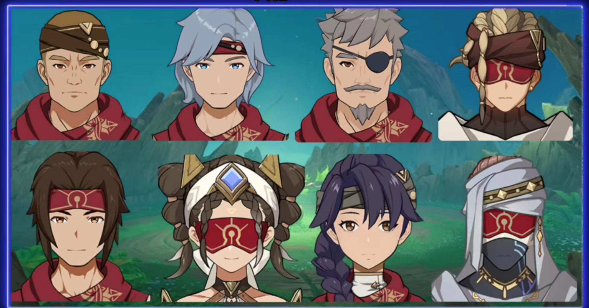
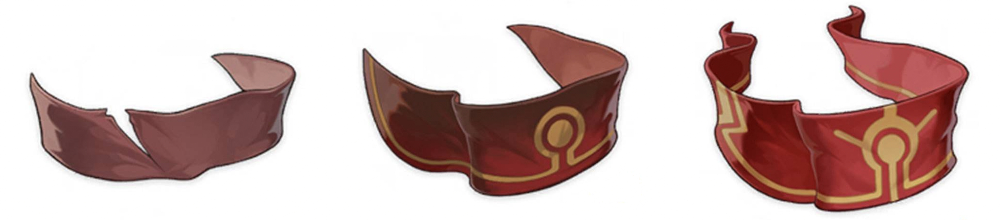
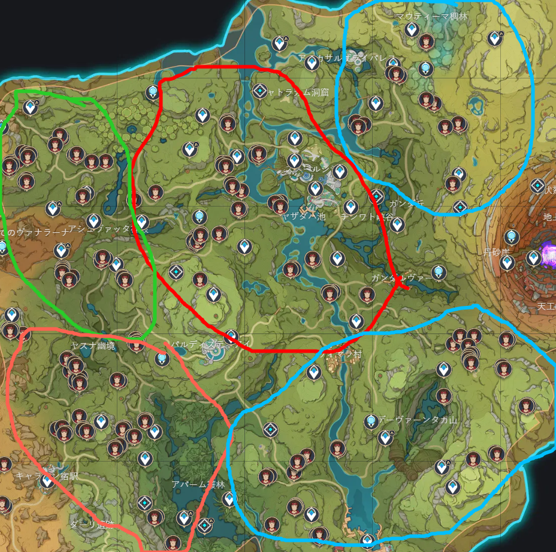
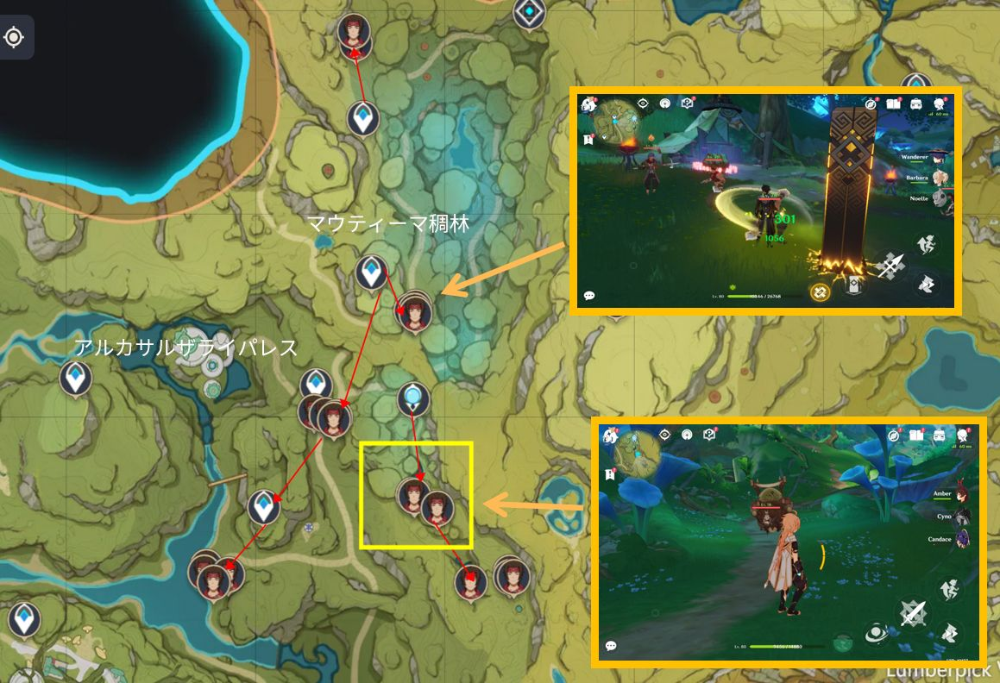
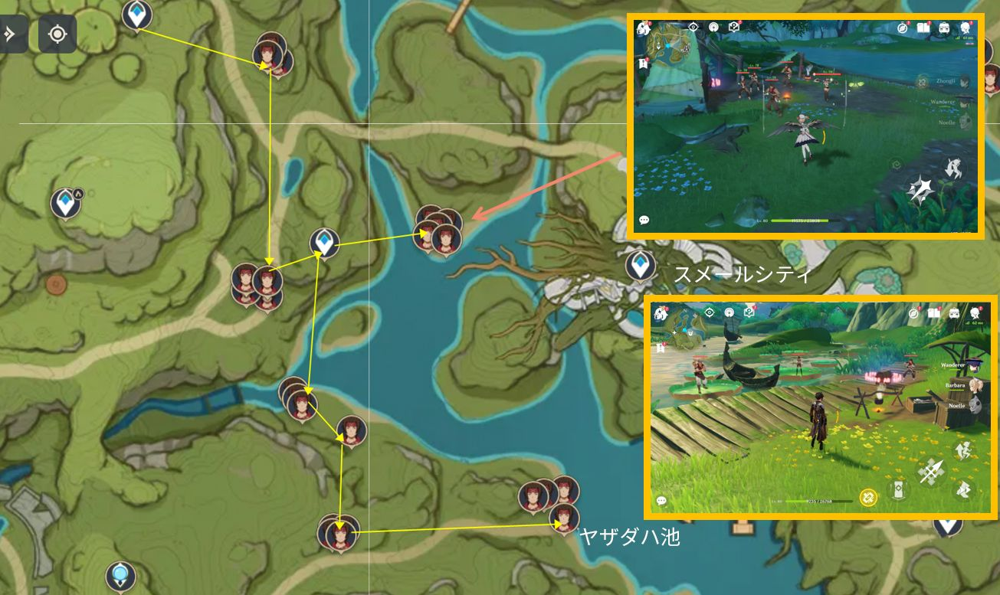
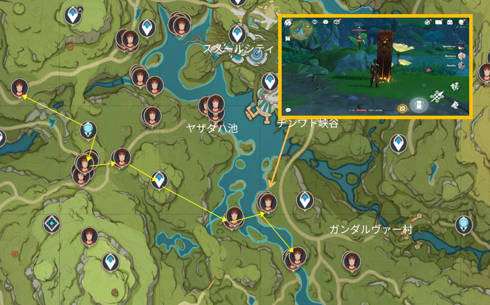
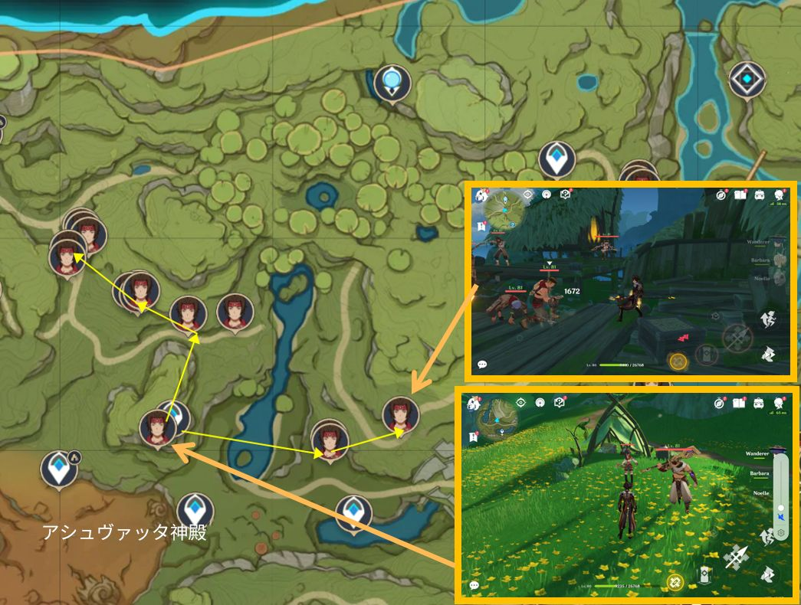
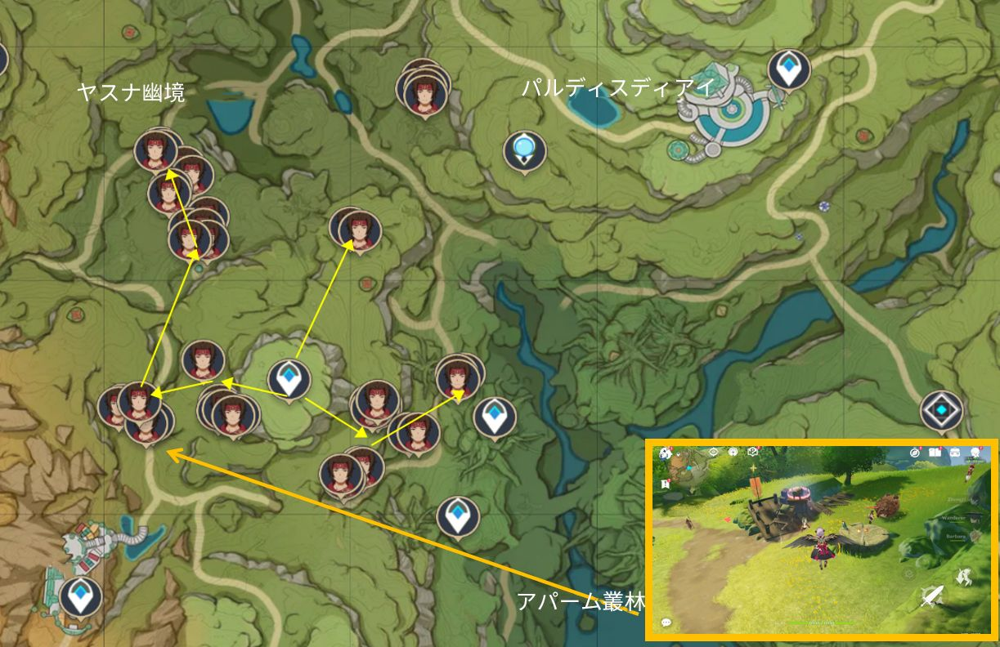
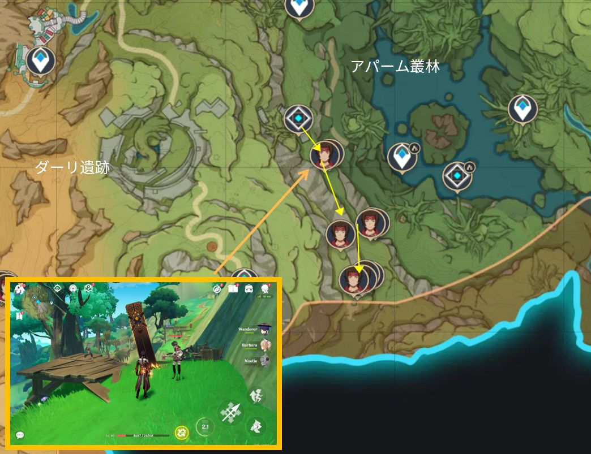
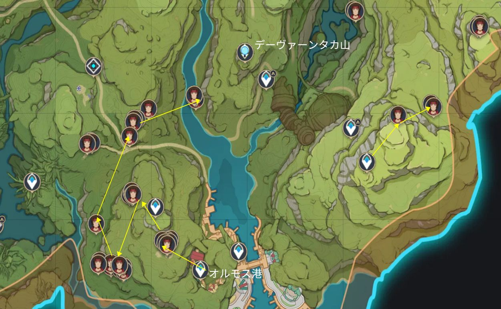

スメールの不*の砂漠に、何の力にも頼らず、傭兵として生き抜く集団、それが【エルマイト旅団】です。 今回は、旅人の皆さんに【エルマイト旅団】の**ルートや対応法を紹介したいと思います。

 

#### 【エルマイト旅団】紹介

【エルマイト旅団】は突破素材の赤い絹を入手できる手段で、特に**ドリー、**ファルザンを育てたい場合、ニーズが大きいです。効率よく赤い絹をもらいたい場合、エルマイト旅団への**線路は重要になります。

**基本情報**：【エルマイト旅団】は一般成員のほか、**エルマイト旅団·サンドウォーター、エルマイト旅団·サンフロスト、エルマイト旅団·デイサンダー**3つのエリート成員がいます。彼らは一定のダメージを受けると魔物化し、自身のスキルが強化されます。一方、魔物化が終了後、彼らは暫く弱体状態になります。この時こそ火力を出すべきタイミングで、見逃さないでくださいね。

**アップデート周期**：約**12時間**

**報酬**：違いレベルのエルマイト旅団を倒すと、もらえる報酬も違います。一般のエルマイト旅団成員では**色褪せた赤い絹**、レベル40以上の場合は**縁飾の赤い絹**、レベル60以上の場合は**金織の赤い絹**をもらえます。

 

**エリート敵のスキルと対応法**：エルマイト旅団·サンドウォーターは4つのスキル「水刃双舞」「水刃打」「激・舞輪双舞」「激・トリプルスラッシュ」の4つのスキルを持っています。最初の2つは通常のスキルで回避位置に注意すればいいし、最後の2つは魔物化スキルでどちらも突撃効果があるので、**モンスターが全力疾走しているのを見たら左か右に移動し、エリート敵は短いチャージ状態に入り、垂直方向に沿って全力疾走します**。

エルマイト旅団·サンフロストのスキルは「氷刃スピンストライク」「氷刃スラッシュ」「激・刃輪スピンダンス（2回）」「激・トリプルヘビースラッシュ」で、後の2つは前2つのスキルの魔物化強化版です。スキル1は氷のナイフを振ってスピン攻撃を受け、スピン攻撃の範囲が大きいので、サンフロストのチャージ姿を見るとき、敵の体から離れましょう。スキル2は主に3段の連続チョップで、最初の2段の攻撃範囲が小さく、回避すれば良く、最後の段は諸刃の攻撃で、範囲が大きく、**事前に敵から離れる**必要があります。 スキル3はナイフ2発の巻き込み攻撃で、縦に速い攻撃なので左右どちらかに回避し、2**避することを忘れないようにしましょう。 スキル4はスキル2よりも範囲が広く、間隔が短いので、**攻撃の隙をついて回避か、盾を開いて受けるのがおすすめです**。

エルマイト旅団·デイサンダーのスキルはほかの二人と似て、タイムリーに回避し、敵がチャージしてるときに攻撃すれば問題なしです。

 

#### **「線路」**

エルマイト旅団は広範囲で数が多いので、ドロップ率が高く、**る敵が**集中しているルート**を狙うのがおすすめです。 なお、**旅団の駄獣**もいる拠点があり、ドロップ率が非常に高いので、**見逃さないようにしましょう**。 まずは全体的なエリアマップで、大まかなスタートとルートを把握しましょう。

 

**路線１：マウティーマ稠林+ローカパーラ密林**

下図のように、マウティーマ稠林のワープポイントから出発しガンダ丘方面へ。途中、山や川を通るので、小さなモンスターが出現しますが、それを退治すればOKです。 注：黄*い箱の*くに2匹の**駄獣**がいます、見逃さないでください。

**路線２：スメールシティ+ヤザダハ池**

このルートは2つに分かれていて、1つはスメールシティの左側、ヤザダハ池の土手に沿って歩くだけ、途中にモンスターがいる、図の下2点に**駄獣**がいます。

 

もう1つのルートは、郊外からヤザダハ池に向かって進み、ヤザダハ池沿いで**可能。また、**ーパーマークを使うことで加速することができます。 途中のワープポイント付*には、**駄獣**が出現する拠点が2箇所あります。

 

**路線３：ヴァナラーナ **

下図で示しているワープポイントから出発、2ルート分けます。ルート１は上へ、ルート２は下へ**すれば問題なしです。

 

**路線４：ヤスナ幽境+キャラバン宿駅+アシャヴァンレルム**

ルート4はエルマイト旅団が密集しています。まず、ヤスナ幽境から出発します。ここのエルマイト旅団は**桟橋の端**まで行かないと出現しないことに注意しましょう。 次に、キャラバン宿駅から**。ここには2体の隠**しモンスター**がいることに注意。 最後にアシャヴァンレルムに向かい、下図に表示された道順に従って進んでください。

 

**路線５：アルダラビ河谷**

この2箇所は距離が離れているので、2回に分けることをお勧めします。 注意すべきのは、複数のモンスターを一回**引くこと**です。

 

#### **【まとめ】**

エルマイト旅団の数と拠点は多いため、皆さんは自分のニーズによって**線路を決めましょう。チーム編成について、**ｗ風キャラ（特にモンスターを巻き込めるウェンティ！）**で効率を高めましょう。以上はエルマイト旅団の**線路紹介でした！皆さんのお役に立てると嬉しいです！

Version: [zh-tw](../9422055/article)[ja-jp](../9423533/article)[en-us](../9428838/article)[es-es](../9431062/article)[ru-ru](../9433199/article)[tr-tr](../14181100/article)[it-it](../14180853/article)

