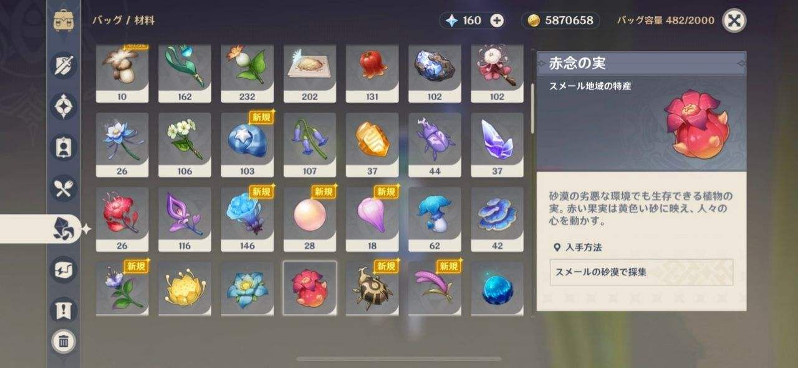
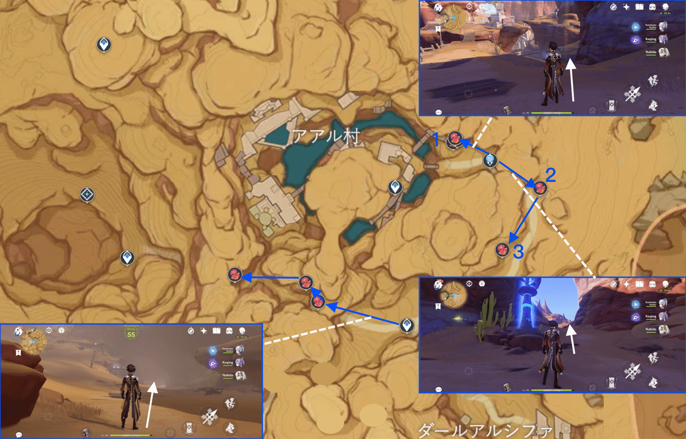
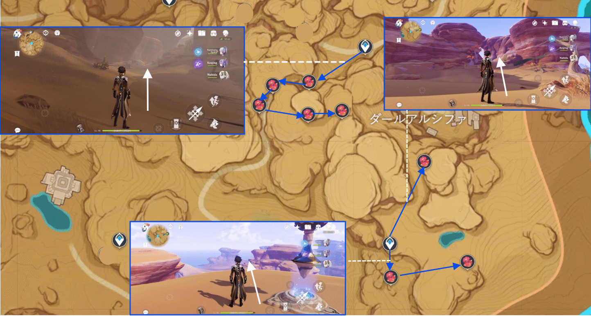
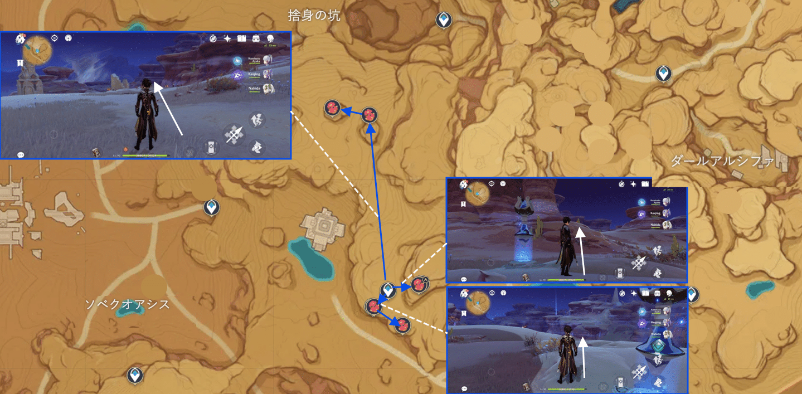
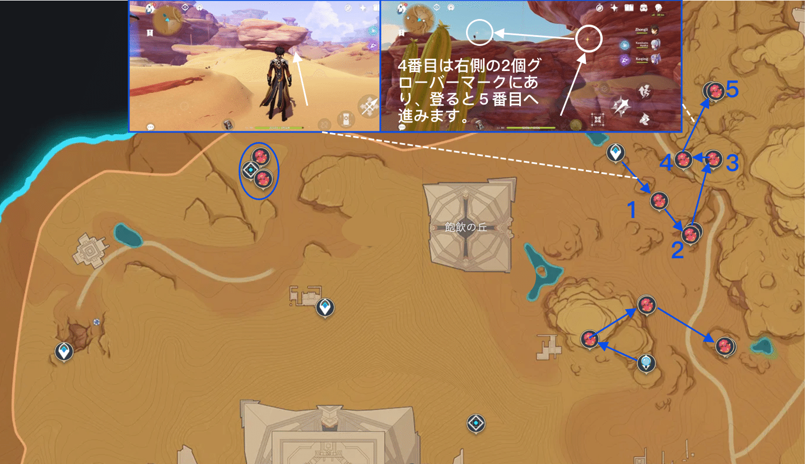
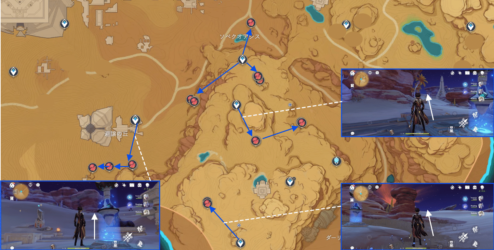
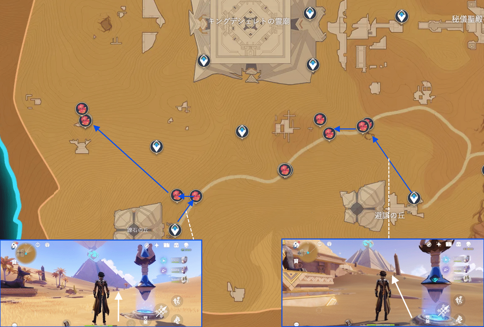
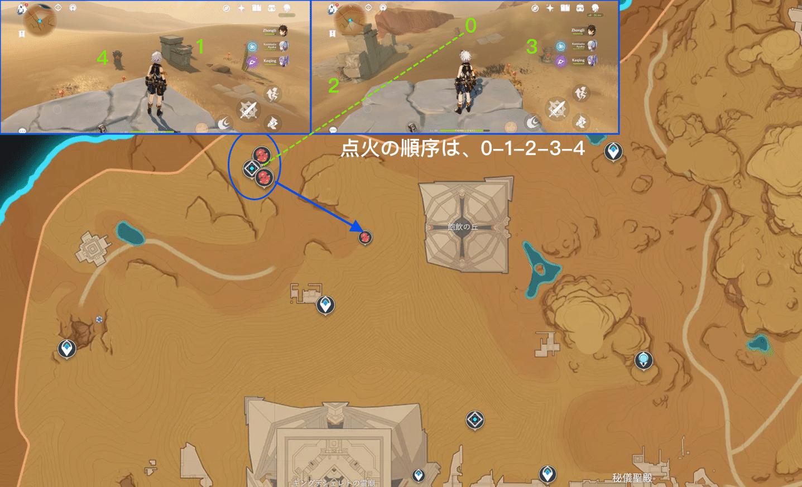

赤念の実は原神で重要な**キャンディス**、**ファルザン**の**キャラクター突破素材**として、急いで採集している旅人も赤念の実は原神で重要なキャンディス、ファルザンのキャラクター突破素材として、急いで採集している旅人も多いのではないでしょうか？赤念の実は須弥スメール砂漠に広く分布し、数も多いので、今回は赤念の実が密集し、効率よく採取できるルートをご紹介します！

 

#### **【赤念の実とは？】**

**場所の分布**：**スメール地域**の特産品として赤念の実はスメール砂漠の特有の素材です。赤念の実はサボテンの実で、サボテンにしか実がならないため、主に**地表にあり**、見つけるのは難しいことではありません。しかしスメール砂漠そのものの特質が、採集にかなりの支障をきたすことになりました。例えば蜃気楼は、、すごく遠くに赤念の実が見えていて、*づいても見つからないことがあったり、*くで見えないのに後で突然に見えてきたり… そういう状況も存在するから、採集により注意を払う必要があります。次の点に注意してください：**サボテンに赤念の実がついているとは限らないが、赤念の実は必ずサボテンについています**。道端でサボテンを見かけたら、探してみてください。

 

**使い道**：赤念の実の主な役割は**キャンディス**、**ファルザン**のレベル突破素材であり、需要量が少なくないです。

**リポップ時間**：**採取してから48時間後にリポップします。**

**マップ探索のおすすめ**：

赤念の実はスメールの中で、数が多く、分布が広いので、マップ探索はちょっと疲れています。**2人の風元素キャラクターをおすすめします。**体力の消耗を減らせながら移動速度を上げることもできます。**万葉、夜蘭、早柚**などのキャラクターがいいですね。また、ティナリをおすすめします。ティナリの固有天賦は採取効率を大幅に向上させることができます。アイテムと料理の面では、道に急ぐ必要がありますから、**体力の消耗を減らすことができるもの**を十分に用意することをおすすめします。

 

#### **【採集ルート】**

**ルート1：アアル村周辺****（8個）**

図示されたWPからの沿線採集では合計8個の赤念の実が得られます。

 

**ルート2：ダールアルシファ付****（18個）**

ダールアルシファの*くには全部で3つのルートがあります。1つ目はいダールアルシファの左上側で、アアル村の下のルート地点から直接下ることができます。2つ目はダールアルシファの下ですが、3つ目はダールアルシファの左側にあります。

 

**コース3：飽飲の丘、砂の目周辺エリア****（19個）**

このルートは分布域が広く、通常中間の2つのルートの赤念の実を採集すればよいとお勧めです特筆すべきは、上記のコースの最後の2つの赤念の実は高い位置にあり、**ーバーマークで飛んで採取する必要があることです。

 

**ルート4：ソベクオアシス+避譲の丘****（16個）**

ソベクオアシスのルートは赤念の実がの分布が集中していて、採取は難しくはありません。避譲の丘の三個は少し離れていますが、**ーバーマークが多いので効率的に採集できますので、ついでに採集するのがおすすめです。メモ：避譲の丘の南側を過ぎたところで蜃気楼に遭遇し、アチーブメントを達成ことができます、お見逃しなく。

 

**ルート5：鑠石の丘****（12個）**

ルート4の避譲の丘付*を出て、そのまま歩いて鑠石の丘を探索して、沿線で採集すればいいです。

 

**ルート6：飽飲の丘****（千柱の花園6個）**

このポイントは相対的に面倒で、謎解きをしないと手に入りません。メインスキルは火元素石碑の横の烈焔花の数により、0から4まで、順番に火元素石碑を灯し、謎解きを完成させると秘境千柱の花園を解放できます。気をつけたいのは、エアーの壁で攻撃が遮られるので、自分で適当な角度をして攻撃しましょう。

#### ** **

#### 

#### **【まとめ】**

全体的に、スメール砂漠の赤念の実はまだかなり数多いので、スメール砂漠のマップを一目、それはどこでものように感じますが。ですから**密集ポイントに採集すれば**もう十分です。注目すべきは、赤念の実の採取には多くの道を歩かなければならないので、**早柚などの2人の風元素の組み合わせ**は採集効率を大幅に向上させることができ、非常におすすめです。さて、今期の内容はこれで、赤念の実を早く集めるのにお役に立てれば幸いです。

Version: [zh-tw](../9974262/article)[ja-jp](../9989311/article)[es-en](../9977641/article)[es-es](../9980467/article)[ru-ru](../10001788/article)[tr-tr](../14178398/article)[it-it](../14178164/article)

